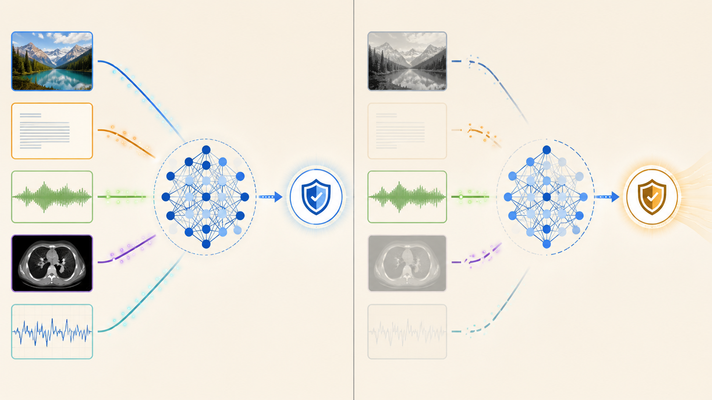
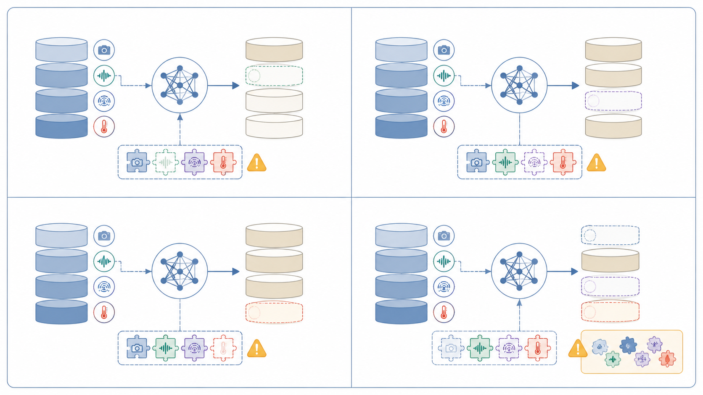
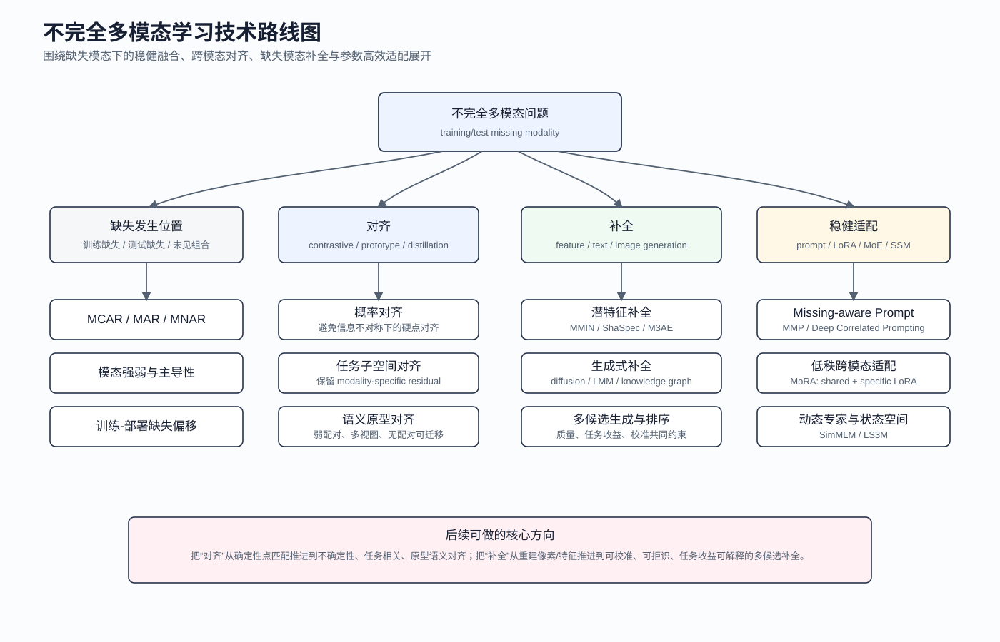

# 不完全多模态学习：当模型看不全世界时，如何还能做出可靠判断？

如果把多模态模型放在论文实验室里，它通常生活在一个很理想的世界：图像在，文本在，音频在，医学影像序列完整，传感器数据也按时到达。训练集和测试集都整整齐齐，每个样本都带着模型期待的全部输入。

但真实系统不是这样工作的。

一个无人机双光检测系统可能白天依赖 RGB，夜间依赖红外；可一旦低照、过曝、热交叉、传输延迟或某一路相机短暂掉线，模型看到的世界立刻变得不完整。一个医疗 AI 系统可能希望同时看到 T1、T1ce、T2、FLAIR 多个 MRI 序列，但真实临床流程里并不是每个病人都有完整检查。一个情感识别模型可能同时使用语言、音频和表情，但线上部署时麦克风噪声、摄像头遮挡和语音缺失都很常见。

这就是不完全多模态学习要处理的问题：**当模型本来应该看到多个模态，但训练或测试时只能看到其中一部分时，它如何仍然做出可靠判断？**

图 1：左侧是理想的完整多模态输入，多个信息源共同进入模型；右侧是更接近真实部署的输入状态，部分模态缺失、断裂或低质，但模型仍需要输出可靠判断。

我现在更倾向于先把问题框架钉住：不完全多模态到底难在哪里？它和普通多模态学习、不完全多视图学习、缺失数据分析有什么关系？现有方法大致分成哪些技术路线？为什么这个方向正在从“把缺失模态补回来”走向“在有限证据下做可信决策”？

这个框架后面会直接影响我对无人机 RGB-IR 双光融合、可信模态补全、区域-频段质量感知和实验闭环的判断。如果这里的定义含混，后面的方法设计很容易退化成“缺一路就补一路”的直觉方案。

## 1. 多模态模型为什么怕“少看一路输入”

多模态学习的基本动机很简单：不同模态携带不同类型的信息。图像提供空间结构和视觉纹理，文本提供语义描述，音频提供语调和节奏，红外提供热响应，医学多序列影像提供不同组织对比。把这些模态合在一起，模型理论上能获得更完整的证据。

但这个优势有一个隐含前提：模型在训练和测试时都能看到类似的模态组合。

如果训练时模型一直看到图像和文本，它可能学会“文本强、图像弱”的捷径；一旦测试时文本缺失，图像分支并没有被训练成足够独立的决策路径。如果训练时 RGB 和红外总是同时出现，融合模块可能默认两路特征都可靠；一旦红外失效，融合模块仍然把红外噪声当作有效证据送入检测头。对于 Transformer 类结构，缺失模态还会改变 token 组成、注意力分布和跨模态交互路径，影响的不只是输入维度，而是整个推理过程。

所以，“少看一路输入”的影响通常不是线性的。它至少同时改变三件事：

1. **信息量改变**：缺失模态携带的互补信息不再可用。
2. **模态关系改变**：原本学到的跨模态对齐、互补和依赖关系被破坏。
3. **模型路径改变**：融合层、注意力层、专家路由或 prompt 适配器收到的输入状态发生变化。

这也是为什么简单把缺失模态置零、复制一份可见模态、随机 dropout 一路输入，往往只能解决一部分问题。缺失模态带来的不是一个空位，而是一种不确定状态：模型需要知道自己少了什么、还能相信什么、什么时候应该降低置信度。

这和人类判断很像。一个医生少了一项检查结果，不会假装它存在；他会调整诊断依据，并对结论更谨慎。一个飞手发现红外链路延迟，不会继续把红外画面当成实时证据；他会转而依赖 RGB 或降低决策速度。多模态模型如果要真正部署，也需要类似的“证据意识”。

## 2. 什么是不完全多模态学习

不完全多模态学习通常可以理解为：一个任务本应使用多个模态，但在训练、验证或测试过程中，部分样本缺少一个或多个模态，模型仍需完成分类、检测、分割、检索、预测或决策任务。

这里有几个关键词。

第一，**本应使用多个模态**。如果一个任务天然只有图像输入，那不是不完全多模态。只有当任务定义或数据设计里存在多个信息源，而这些信息源在某些样本或某些阶段不可用时，才构成 missing modality 问题。

第二，**缺失可能发生在训练，也可能发生在测试**。有些方法假设训练集完整，测试时才缺失；这类设定相对容易，因为训练时可以用完整模态 teacher、跨模态映射或伪缺失增强来学习鲁棒路径。但在医疗、工业和真实采集数据中，训练集本身就可能不完整，这时可用于监督对齐和补全的完整样本非常有限。

第三，**模型目标不是恢复数据本身，而是完成任务**。这点非常关键。缺失模态补全看起来像一个生成或重建问题，但下游任务未必需要完整恢复原始模态。例如目标检测不一定需要生成整张红外图，它可能只需要补足目标区域的热响应证据；医学诊断不一定需要重建完整 MRI 序列，它可能只需要和病灶判断相关的语义表征。

不完全多模态和不完全多视图学习也很接近。多视图学习里的不同视图可以是同一对象的不同特征源，例如 Caltech101 的不同视觉特征、MNIST-USPS 的不同手写数字视图。不完全多视图聚类研究了视图缺失、弱配对、共识语义等问题，其中很多思想可以迁移到多模态任务。但多模态通常更强调异构输入：图像、文本、音频、红外、医学影像、临床记录之间的结构差异更大，任务目标也更复杂。

因此，不完全多模态不是普通多模态学习的一个小补丁，而是一个独立问题。它关注的是：在模态可用性变化的情况下，模型如何构造稳定、可信、任务相关的表示和决策路径。

## 3. 四类缺失设定：不要把 missing modality 只理解成测试时 dropout

很多论文实验会做一个简单设定：训练时用完整模态，测试时随机删掉某一路模态，然后比较性能下降。这当然有价值，但它只是整个问题空间里最容易的一角。

更完整地看，至少有四类设定。

图 2：不完全多模态至少包括训练完整测试缺失、训练缺失测试缺失、训练/测试缺失模式不一致、未见模态组合泛化四类设定。不同设定对应的模型假设和实验难度不同。

### 3.1 训练完整，测试缺失

这是最常见、也最容易构造的设定。训练集中每个样本都有完整模态，模型可以充分学习跨模态关系；测试时模拟某一路或多路模态缺失。

典型例子包括：

- 图文分类中测试时缺图像或缺文本；
- 多 MRI 序列分割中测试时缺少某个序列；
- RGB-IR 检测中部署时一路传感器掉线；
- 多模态情感识别中音频或视频不可用。

这个设定的优势是实验可控。训练阶段可以构造完整模态 teacher，也可以人为 mask 某个模态做对比学习、蒸馏或补全训练。缺点是它可能高估模型在真实场景中的表现，因为真实训练数据本身常常并不完整。

### 3.2 训练缺失，测试也可能缺失

这类设定更接近真实数据。医疗数据尤其典型：并不是每个病人都有所有检查项；有些检查昂贵，有些检查只对特定病情开具，有些检查因流程或隐私原因缺失。情感识别和工业传感器数据也类似，采集链路本身就不稳定。

这时模型不能假设有大量完整样本用于监督补全。它必须从部分配对、部分完整、甚至大量不配对样本中学习跨模态结构。

这个设定下，直接做“缺什么补什么”会更危险。因为可用于学习补全映射的真实配对数据有限，模型容易学到伪相关。更稳妥的方向通常是学习任务相关共享语义、模态特异残差和不确定性，而不是强行重建完整模态。

### 3.3 训练和测试缺失比例不一致

现实部署中，缺失率往往不是固定的。训练时可能只有 30% 样本缺失某个模态，但部署到弱网络、低成本设备或极端天气环境后，缺失比例可能上升到 70%。如果模型只在一个固定缺失率下调好参数，它很可能在缺失率变化时崩掉。

这类设定考验的是模型对缺失强度的泛化。好的实验不应该只报告一个 missing rate 下的结果，而应该画出从低缺失到高缺失的性能曲线，甚至计算鲁棒性面积。

### 3.4 未见模态组合泛化

如果有三个或更多模态，训练时不可能覆盖所有缺失组合。例如训练中见过 `{图像, 文本}`、`{文本, 音频}`，但测试时出现 `{图像, 音频}`；或者训练时只见过单模态缺失，测试时出现双模态同时缺失。

这就是 unseen modality interaction 问题。它要求模型学到一种可组合的模态交互规则，而不是为每个模态组合训练一个独立分支。

这个问题对模型设计提出了更高要求：prompt、adapter、expert、router 或 prototype 不能只记忆训练中出现过的组合，而要能根据可见模态集合动态构造决策路径。

四类设定放在一起看，missing modality 不是一个单一 benchmark，而是一组关于可用信息、训练监督和组合泛化的系统问题。判断一个方法之前，我会先问三个问题：它解决的是哪一种缺失设定？它是否依赖完整训练样本？它能否泛化到未见组合？

## 4. 缺失机制：为什么随机 dropout 不够

除了缺失发生在哪个阶段，还要关心缺失是怎么发生的。这里可以借用缺失数据分析里的三个概念：MCAR、MAR 和 MNAR。

**MCAR** 指 Missing Completely At Random，也就是完全随机缺失。某个模态是否缺失，与样本内容、标签、环境、设备都无关。论文里常用的随机 modality dropout 基本属于这一类。

MCAR 的好处是干净、可控、容易复现。但它也是最理想化的。真实世界里，传感器很少完全随机坏掉，检查项也很少完全随机缺失。

**MAR** 指 Missing At Random，缺失和可观测变量相关。例如低成本设备更可能缺少某个传感器；夜间场景 RGB 更容易低质；网络带宽差时视频模态更可能丢帧；某些医院因为流程不同而缺少某些检查项。这里的缺失不是随机的，而是和环境、设备、域或采集条件相关。

**MNAR** 指 Missing Not At Random，缺失和不可观测因素、标签或任务难度相关。例如重症患者更可能缺少某些检查，因为无法完成完整流程；极端天气下不仅传感器更容易失效，目标检测本身也更难；红外热交叉场景中 IR 低质和目标类别、背景温度可能同时相关。

真实应用往往更接近 MAR 或 MNAR。这会带来一个严重问题：如果模型只在 MCAR 上训练和评估，它可能学到一种“平均意义上的鲁棒性”，但无法处理真实部署里的系统性缺失。

以无人机 RGB-IR 为例，随机删掉一半红外帧并不能模拟真实红外失效。真实失效可能连续发生，可能和地面高温、目标热响应、飞行高度和时间同步相关。模型在随机缺失下表现好，不代表它能应对热交叉、低照、通信延迟和弱配准。

因此，缺失机制本身应该成为实验设计的一部分。一个更扎实的不完全多模态工作，不仅要问“缺失率是多少”，还要问：

- 缺失是否和场景相关？
- 缺失是否和类别或难度相关？
- 缺失是否连续发生？
- 缺失是否伴随模态质量下降？
- 训练和测试的缺失机制是否一致？

这些问题决定了模型是不是只在玩随机 mask 游戏，还是在处理真实部署问题。

## 5. 技术路线一：稳健融合与结构适配

最直接的一类方法，是让融合结构本身适应缺失输入。

普通多模态融合可以分成早融合、晚融合和中间层融合。早融合在输入或浅层特征阶段就把模态拼接起来；晚融合让每个模态先独立预测，再合并结果；中间层融合则在 Transformer、cross-attention 或多尺度特征层中进行交互。

当模态完整时，这些方法都可能有效。但当模态缺失时，固定融合结构会暴露问题。早融合依赖固定输入维度，缺一路就要填零或填均值；cross-attention 依赖模态 token 的存在，缺失会改变注意力分布；晚融合虽然天然能处理某些缺失，但如果每个单模态分支训练不足，缺失时仍然会崩。

因此，稳健融合方法通常会引入几类机制。

第一类是 **missing-aware mask**。模型显式接收模态是否存在的指示变量，融合时对缺失模态做 mask。这比简单置零更合理，因为模型知道某个输入是“不可用”，而不是一个真实的零值输入。

第二类是 **modality dropout / conditional dropout**。训练时随机丢弃模态，让模型提前见过缺失情况。它的优点是简单有效，缺点是容易停留在 MCAR 层面。如果真实缺失是连续、场景相关或质量相关的，随机 dropout 仍然不够。

第三类是 **多专家结构**。例如 RGB expert、IR expert、fusion expert、completion expert 分别处理不同输入状态，再由 gating network 决定使用哪个专家。这类方法的关键不只是专家数量，而是路由依据是否可靠。如果 router 只看模态是否存在，它无法处理软失效；如果 router 能看质量、不确定性和任务置信度，就更接近真实需求。

第四类是 **排序或一致性约束**。例如 More-vs-Fewer 思想：拥有更多模态的输入不应该比更少模态的输入表现更差。这种约束能抑制融合模块在完整输入下反而退化的问题，也能让模型学习不同模态组合之间的相对关系。

稳健融合的优点是实用、易插入现有模型，也不一定需要生成缺失模态。它的局限也很明显：很多方法主要处理“模态是否存在”，而不是“模态是否有效”。现实里更常见的是图像还在，但低照、模糊、热交叉或错位导致它不值得相信。仅有 missing mask 无法表达这种软失效。

这也是 RGB-IR 双光融合里必须引入 modality validity 的原因。

## 6. 技术路线二：Shared-Specific 表征

另一类重要方法试图回答一个更根本的问题：不同模态之间到底哪些信息应该共享，哪些信息应该保留差异？

如果把所有模态都强行对齐到同一个空间，模型可能丢掉模态特有的信息。文本、图像、音频、红外并不是同一种信号的不同格式；它们各自携带一些不能互相完全推断的内容。RGB 的纹理和颜色不等于 IR 的热响应，音频的语调不等于文本的字面含义，MRI 不同序列也不是简单互相替代。

Shared-Specific 表征的核心思想是把特征拆成两部分：

- **shared feature**：跨模态共享、和任务相关的语义信息；
- **specific feature**：每个模态独有、不能或不应被其他模态完全替代的信息。

在缺失模态场景下，这个拆分很有价值。缺失模态未必能被完整恢复，但它和可见模态共享的那部分语义，也许可以从可见模态中推断出来。比如图文分类中，图像和文本都能表达“食物类别”；RGB 和 IR 都能表达“这里有一辆车”；多 MRI 序列都可能共同指向“肿瘤区域”。这些是 shared information。

但模态特异信息不能被随便补。RGB 的颜色、IR 的热强度、音频的声学细节、特定 MRI 序列的组织对比，都可能是 specific information。强行让模型从其他模态恢复这些细节，容易产生幻觉或伪相关。

因此，一个合理的不完全多模态模型不应该问“如何把缺失模态完全生成出来”，而应该问：

1. 下游任务需要哪些共享语义？
2. 哪些模态特异信息无法可靠恢复？
3. 缺失时是否应该补共享语义，而不是补私有细节？
4. 如果要补模态特异残差，能否同时估计不确定性？

这个思想对可信补全非常重要。尤其在检测任务里，我不认为完整图像补全是最优目标；更合理的对象通常是目标区域的共享语义和少量模态残差。

## 7. 技术路线三：对比学习、语义原型与多视图迁移

对比学习和原型学习是另一条常见路线。它们的目标不是直接生成缺失模态，而是学习一个跨模态一致的表示空间。

最直观的是 instance-level alignment：同一个样本的不同模态应该靠近，不同样本应该远离。这在完整配对数据上很自然，比如图像和文本 caption、音频和视频片段、RGB 和 IR 图像对。

但在不完全多模态里，硬实例对齐有两个风险。

第一，缺失模态导致信息不对称。一个缺失样本只看到图像，完整样本看到图像和文本。要求缺失样本的表示精确对齐完整样本，可能过于严格。缺失输入本来就少了信息，它不应该被迫预测无法从可见模态中确定的细节。

第二，弱配对或非配对数据会引入噪声。在不完全多视图和真实多模态数据中，同一个对象的不同视图不一定严格配对；或者配对关系本身存在时间偏移、空间错位和采集误差。此时逐样本对齐可能把噪声当成监督。

语义原型提供了另一种思路。与其要求每个样本跨模态精确对齐，不如构建若干任务相关的语义原型，让语义相近的样本靠近同一原型。原型可以来自标签、聚类、teacher 表征、文本描述或领域知识图谱。

这种 prototype-level alignment 对高缺失率、弱配对和训练缺失场景更友好。它不要求缺失样本恢复完整模态的所有信息，只要求它落到合理的任务语义区域。对于分类、聚类、检索和医疗诊断，这往往比重建原始模态更稳。

不完全多视图学习中的一些新趋势也值得迁移。例如 imputation-free、alignment-free 的共识语义学习认为，在严重缺失和非配对情况下，强行补全或逐实例对齐反而可能引入噪声；更合理的是学习一个任务相关的共识语义空间。

这个观点很有启发：不完全多模态不一定必须补全，也不一定必须硬对齐。很多时候，任务只要求模型在可见证据下找到正确语义，而不是恢复一个不存在的完整世界。

## 8. 技术路线四：蒸馏与概率对齐

知识蒸馏是处理缺失模态的经典思路：用完整模态 teacher 指导缺失模态 student。

训练时，如果完整模态可用，teacher 可以看到所有输入，得到更强的表征或预测。student 只看到部分模态，通过学习 teacher 的 logits、feature、attention map 或关系结构，获得在缺失输入下更稳定的能力。

这个思路很自然，也很有效。但它有一个需要警惕的地方：teacher 和 student 的信息条件不同。

完整模态 teacher 看到的是更完整的证据；缺失模态 student 只看到部分证据。要求 student 精确复制 teacher 的中间特征，可能是不合理的。因为 teacher 的某些判断来自 student 根本看不到的信息。如果强行点对点对齐，student 可能学到伪相关，或者在不确定场景中过度自信。

这就是为什么近年来一些方法开始从确定性点对齐转向概率对齐和不确定性对齐。

与其要求缺失表示对齐到完整表示的一个点，不如让模型预测一个分布：给定可见模态，完整模态语义可能落在哪些区域？这个分布可以是高斯、混合高斯、Dirichlet、evidential distribution，或者更简单的不确定性估计。

概率对齐承认一个事实：缺失信息无法凭空恢复。模型能做的是表达“我根据现有证据推断它大概在这个范围内”，而不是假装“我知道完整模态是什么”。

这对可信系统尤其重要。如果模型知道自己的缺失推断不确定，它就可以：

- 降低补全特征的权重；
- 退回单模态 expert；
- 触发拒识或人工复核；
- 在输出中降低置信度；
- 避免把伪补全当成强证据。

蒸馏的未来价值不只是让 student 追 teacher，而是让 student 学会在信息不足时如何合理表达不确定性。

## 9. 技术路线五：补全、生成与大模型

补全是最直观、也最容易被误解的一条路线。

如果缺图像，就生成图像；缺文本，就生成文本；缺 IR，就从 RGB 生成 IR；缺 MRI 序列，就从其他序列生成它。这样看起来可以把不完全输入变成完整输入，然后复用完整多模态模型。

早期补全方法常常优化 reconstruction loss，例如 L1、L2、MSE 或 perceptual loss。后来出现了 feature-level completion、masked autoencoder、diffusion-based completion、大模型和知识图谱辅助补全等路线。它们的生成能力越来越强，补出来的东西也越来越像。

但这里有一个核心问题：**补得像，不等于对任务有用。**

对于目标检测，模型关心的是目标位置、类别、边界和置信度。全图重建损失可能主要被背景像素主导；补全图像看起来平滑、自然，却没有补到小目标的关键边缘。对于医学诊断，生成的影像序列也许视觉上合理，但如果病灶区域被平滑掉或生成了伪病灶，风险更高。

所以补全方法正在从三方面变化。

第一，从原始模态补全转向特征补全。生成一张图像太难，也容易引入视觉幻觉；补任务特征可能更直接、更轻量。

第二，从单候选补全转向多候选补全。缺失模态本质上是多解问题，单一生成结果会隐藏不确定性。多候选生成再排序，可以让模型选择更符合任务和语义约束的候选；如果候选分歧过大，则拒绝补全。

第三，从 reconstruction-driven 转向 task-aware completion。补全目标不应只问“像不像”，还要问“是否提升下游任务”“是否校准”“是否降低错误风险”。

大模型和知识图谱也带来了新机会。它们可以提供领域先验、文本描述、结构化知识和候选排序能力。例如在医疗、遥感、工业检测中，领域知识可能帮助判断哪些补全结果合理，哪些违反常识。但大模型补全同样需要可验证、可拒识和任务约束，否则只是把幻觉换成更高级的幻觉。

对 RGB-IR 双光检测而言，这个判断非常关键：缺 IR 时，不一定要补一张 IR 图；更可能需要补目标区域的热结构证据、候选框修正信息，或者只在可信时补一点任务相关残差。

## 10. 技术路线六：Prompt 与参数高效适配

随着大规模预训练模型进入多模态任务，prompt、adapter 和 LoRA 也被用于缺失模态适配。

这类方法的基本思路是：不大规模改动 backbone，而是给模型一个“当前模态状态”的提示。例如完整输入用一组 prompt，缺图像用另一组 prompt，缺文本再用另一组 prompt。也可以设计 modality-specific prompt、shared prompt、correlated prompt，让模型根据可见模态集合调整表征。

参数高效适配的优点很明显：

- 训练成本低；
- 适合复用 CLIP、ViLT、BLIP 等大模型；
- 可以为不同缺失模式学习轻量参数；
- 部署时不一定需要多个完整模型。

但它也有局限。prompt 往往擅长告诉模型“现在是什么输入状态”，但它不一定真正恢复缺失信息。如果缺失模态携带了独有证据，prompt 只能帮助模型适配这种缺失，而不能凭空获得那部分证据。

LoRA 和 adapter 类方法则更进一步。它们可以在不同模态或不同缺失组合之间共享部分低秩参数，同时保留模态特异参数。这样既能利用预训练模型已有的跨模态对齐，又不至于完全抹掉 modality gap。

这条路线适合资源有限、已有大模型 backbone、任务更偏分类或检索的场景。对于无人机 RGB-IR 检测这种强空间任务，它可以作为 backbone 适配或模态状态编码的一部分，但很难单独解决小目标、弱配准和软失效问题。

## 11. 技术路线总览

把前面的路线放在一起，可以得到一张不完全多模态学习的问题地图。

图 3：不完全多模态学习可以从缺失发生位置、技术目标和应用场景三个维度理解。技术上大致包括稳健融合、对齐、补全、参数高效适配和共识语义学习等路线。

为了更直观地比较，可以把这些方法压缩成一张表。

| 技术路线 | 核心问题 | 典型做法 | 优势 | 风险 |
| --- | --- | --- | --- | --- |
| 稳健融合 | 缺失时融合结构如何不崩 | mask、dropout、gating、MoE | 实用，易接入现有模型 | 容易只处理硬缺失，忽略软失效 |
| Shared-Specific | 哪些信息共享，哪些信息私有 | shared/specific split、正交约束、跨模态映射 | 避免过度对齐，解释性较强 | shared/specific 分离不好时会引入噪声 |
| 对比/原型学习 | 缺失下如何学稳定语义空间 | contrastive learning、prototype alignment | 适合弱配对和高缺失率 | 实例级硬对齐可能过强 |
| 蒸馏/概率对齐 | 完整模态如何指导缺失模态 | teacher-student、distribution alignment | 能利用完整模态监督 | student 无法复制 teacher 的不可见信息 |
| 补全/生成 | 缺失模态能否被恢复 | image/feature/token completion、diffusion、LMM | 直观，可复用完整模型 | 补得像不等于任务有用，可能产生伪证据 |
| Prompt/LoRA | 如何低成本适配缺失模式 | missing-aware prompt、adapter、LoRA | 训练成本低，适合大模型 | 更像状态适配，不一定恢复信息 |
| 共识语义学习 | 是否可以不补全、不硬对齐 | semantic prototype、consensus space | 适合严重缺失和弱配对 | 对任务语义结构依赖较强 |

这张表也暗示了一个趋势：不完全多模态不再只是“缺失输入处理”，而是在走向更完整的证据管理系统。模型不只是要知道怎么融合，还要知道什么时候不该融合；不只是要补全，还要知道补全是否可信；不只是要输出预测，还要知道预测的不确定性。

## 12. 如何评价不完全多模态模型

评价不完全多模态模型时，不能只看完整测试集上的主任务指标。

完整测试集表现好，只说明模型在理想条件下有效；缺失、低质、错位和未见组合下表现如何，才是这个方向真正关心的问题。

一个更完整的评价体系至少包含以下几类。

### 12.1 主任务指标

不同任务有不同主指标：

- 分类：Accuracy、F1、AUROC；
- 检测：mAP、AP50、AP75、小目标 AP；
- 分割：Dice、IoU；
- 情感识别：ACC、F1、UAR；
- 医疗预测：AUROC、AUPRC。

主任务指标仍然是基础，因为所有补全、对齐、融合最终都要服务任务。

### 12.2 缺失率曲线

只报告一个缺失率不够。更好的方式是从 0% 到高缺失率画曲线，观察模型性能随缺失强度变化的趋势。

如果一个模型只在 30% 缺失率下比 baseline 高，但在 70% 缺失率下崩掉，它的鲁棒性就有限。可以进一步计算 robustness area under curve，把不同缺失率下的表现汇总成一个指标。

### 12.3 缺失组合泛化

对于三模态或更多模态任务，需要单独测试训练中没见过的模态组合。否则模型可能只是记住了出现过的组合，而没有学会可组合的模态交互规则。

### 12.4 质量分组评价

如果模态存在但低质，missing mask 是看不出来的。因此应按质量分桶评估模型，例如：

- 高 RGB 质量 vs 低 RGB 质量；
- 高 IR 质量 vs 低 IR 质量；
- 高 offset 置信度 vs 低 offset 置信度；
- 低频信息强 vs 高频信息强。

这类分析能回答一个重要问题：模型是在平均意义上提升，还是确实在困难子集上更稳？

### 12.5 校准和拒识

缺失输入下，模型不应该盲目自信。校准指标如 ECE、NLL、Brier score 可以衡量置信度是否可靠。risk-coverage 曲线可以衡量当模型拒绝一部分低可信样本后，剩余样本风险如何下降。

对于安全敏感场景，拒识能力很重要。一个模型如果在缺失严重时仍然输出高置信错误预测，比一个会说“不确定”的模型更危险。

### 12.6 推理成本和部署约束

不完全多模态方法常常引入多专家、补全生成器、蒸馏分支或大模型辅助。如果推理成本过高，部署价值会下降。因此还要报告参数量、FLOPs、延迟和显存。

尤其在无人机、边缘设备和医疗实时系统中，鲁棒性和计算成本必须一起看。

## 13. 从“补输入”到“可信决策”

我现在对这个方向的概括是：

> 这个方向正在从“如何把缺失模态补回来”，转向“如何在不完整证据下做出可信、可校准、可拒绝的任务决策”。

图 4：不完全多模态的范式正在从原始输入重建，逐步走向任务相关对齐、不确定性估计、选择性拒识和可信决策。

早期方法更关心 reconstruction：缺什么补什么。后来方法发现，对齐比重建更直接，于是关注 feature alignment、contrastive learning 和 distillation。再后来，研究者开始意识到缺失模态存在不可恢复的信息不对称，确定性对齐会过强，于是引入概率分布、不确定性和校准。现在更有前景的方向，是把补全、对齐、融合、路由和拒识统一到任务收益之下。

这条趋势对具体应用有直接影响。

在医疗场景中，模型不能因为缺少某个检查项就生成一份看似完整但没有临床依据的影像。它应该表达缺失带来的不确定性，必要时建议补充检查。

在情感识别中，缺少音频时模型不能假装知道语调信息；它应该更多依赖语言和视觉，同时降低对讽刺、情绪强度等音频相关判断的置信度。

在无人机 RGB-IR 检测中，红外缺失时未必应该生成整张红外图；更合理的做法可能是补目标级热结构证据，或直接退回 RGB expert。红外存在但热交叉严重时，也不能因为模态“存在”就强行融合。

所以，不完全多模态的核心不是“完整性崇拜”，而是证据意识。模型要知道自己看到了什么、没看到什么、看到的东西是否可靠，以及当前证据是否足以支持输出。

## 14. 小结：不完全多模态的真正问题

不完全多模态学习研究的是：当一个样本本应包含多个模态，但训练或测试时部分模态缺失、低质或组合变化时，模型如何仍然完成可靠任务决策。

它的难点不只是输入少了一路，而是信息不对称、模态关系变化、模型路径变化和不确定性上升。随机 dropout 能提供一个起点，但不足以覆盖真实缺失机制。现有方法可以大致分为稳健融合、shared-specific 表征、对比/原型学习、蒸馏/概率对齐、补全生成、prompt/LoRA 和共识语义学习等路线。

更重要的是，这个方向正在发生一个范式变化：从“补回完整输入”，转向“管理不完整证据”。这意味着未来方法不应只追求补全得像、对齐得近或融合得多，而要追求任务收益、校准可靠、低质拒识和部署鲁棒。

把这个框架落到无人机 RGB-IR 双光融合里，问题会进一步变尖锐：缺失模态只是开始，真正复杂的是硬缺失、软失效、弱配准、频段互补和通信链路退化同时出现。也正是在这个场景里，“模态是否存在”必须升级为“模态是否有效”。
