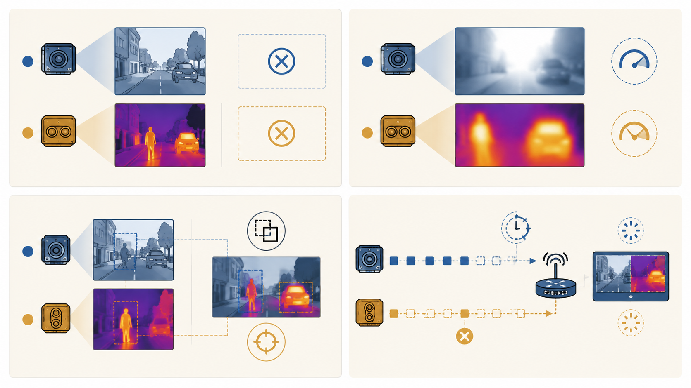
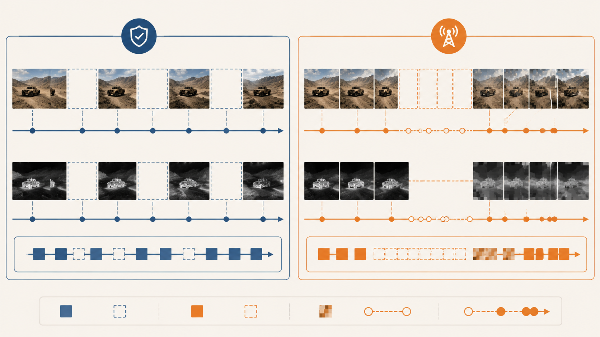
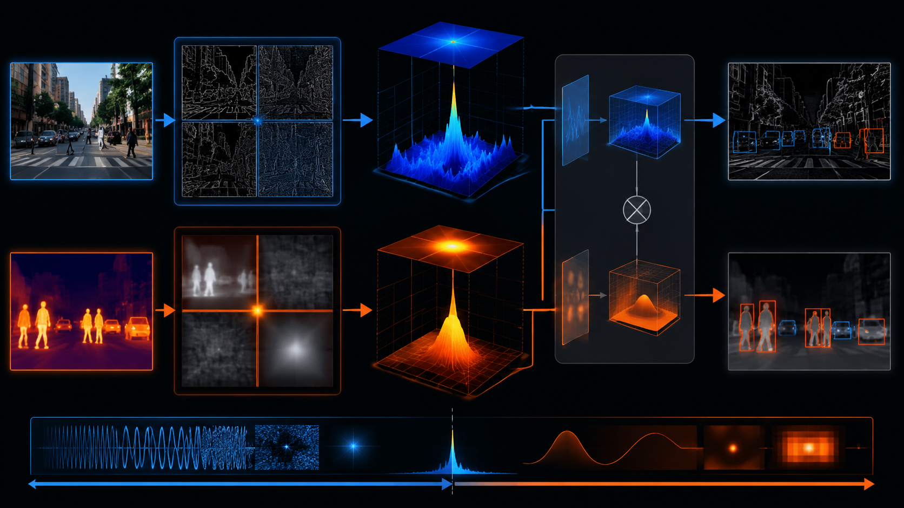

# 无人机 RGB-IR 双光融合：缺一路传感器只是开始，真正难的是软失效与弱配准

无人机 RGB-IR 目标检测的核心价值在于互补感知。RGB 图像提供颜色、纹理、边缘和可见光结构，红外图像提供热响应、夜间目标和低照条件下更稳定的主体轮廓。理论上，两路传感器共同工作可以提升全天候目标检测能力。

真实部署中的困难在于，这种互补关系并不稳定。RGB 可能因为低照、过曝、运动模糊、烟雾和压缩损坏而失效；IR 也可能因为热交叉、地面高温、低分辨率和噪声而失效；两路图像还可能因为传感器安装、飞行运动、时间同步误差和视角差异而出现弱配准。此时问题不再是简单的“RGB 是否存在”或“IR 是否存在”，而是每一路模态在具体区域、具体频段和具体目标候选上是否可信。

图 1：无人机 RGB-IR 检测依赖可见光纹理和红外热结构的互补，但两路证据的可靠性会随环境、目标尺度和传感器状态动态变化。

更准确的问题定义是：**面向无人机 RGB-IR 目标检测的模态有效性感知缺失鲁棒融合**。它强调的不只是缺失模态，还包括软失效、弱配准、频段互补和链路退化。

## 1. RGB-IR 双光检测的任务特点

RGB-IR 属于典型视觉多模态任务，但它和图文分类、语音文本情感识别这类多模态任务有明显差异。RGB 和 IR 都是空间视觉模态，二者需要在位置、尺度和语义上共同服务检测框输出。因此，双光融合同时涉及三个层面：

1. **语义互补**：RGB 和 IR 对目标类别、目标存在性和场景结构提供不同证据。
2. **空间互补**：检测框依赖边界、轮廓和目标中心位置，两路模态的空间错位会直接影响定位。
3. **质量互补**：某一路模态并非全局可靠，它可能只在部分区域或部分频段上更有价值。

无人机视角进一步放大了这些问题。目标通常更小，背景更复杂，运动模糊和视角变化更明显，弱配准造成的几像素偏移就可能影响 ROI 内的有效特征。普通双光融合方法如果默认两路输入完整、清晰且对齐，就很难覆盖这种部署状态。

## 2. 从模态完整性到模态有效性

最简单的缺失模态建模只需要一个二值变量：

$$
m^r,m^t\in\{0,1\}
$$

其中 $m^r$ 表示 RGB 是否存在，$m^t$ 表示 IR 是否存在。这个建模能覆盖硬缺失，但无法表达软失效。实际检测中，图像存在并不等于图像可靠。

更合理的建模方式是引入区域级有效性：

$$
a_i^m=m^m\cdot q_i^m,\quad m\in\{r,t\}
$$

其中 $q_i^m$ 表示第 $i$ 个区域、patch、anchor 或 detection query 上的软质量。最终检测模型应依赖：

$$
\hat{y}=f_\theta(F^r,F^t,m^r,m^t,q^r,q^t,\Delta,u_\Delta)
$$

其中 $\Delta$ 是跨模态 offset，$u_\Delta$ 是 offset 不确定性。这个表达把硬缺失、软失效和弱配准纳入同一个决策框架。

这种建模带来的变化很直接：融合模块不再只关心“是否有两路输入”，而要判断“当前目标区域该相信哪一路、是否应该对齐、是否应该融合、是否应该退回单模态”。

## 3. 四类关键退化

无人机 RGB-IR 不完全问题至少包括四类退化：硬缺失、软失效、弱配准和链路退化。

图 2：真实双光系统不只面对硬缺失。软失效、跨模态弱配准和通信链路退化同样会破坏融合决策。

### 3.1 硬缺失

硬缺失指某一路传感器完全不可用。例如 RGB 相机掉线、IR 数据传输中断，或者部署时只允许使用单路输入。

在 M3FD 上的快速评估显示：

| case | P | R | mAP@0.5 | mAP@0.75 | mAP@0.5:0.95 |
| --- | ---: | ---: | ---: | ---: | ---: |
| full_clean | 0.900 | 0.838 | 0.879 | 0.616 | 0.586 |
| missing_ir_rgb_rescue | 0.860 | 0.759 | 0.815 | 0.516 | 0.503 |
| missing_rgb_ir_rescue | 0.816 | 0.714 | 0.760 | 0.483 | 0.472 |

相较完整双光，IR 缺失导致 mAP@0.5 下降 $0.064$，RGB 缺失导致下降 $0.119$。这说明双光互补确实有效，同时也说明当前模型对 RGB 的边界、纹理和小目标细节依赖更强。

### 3.2 软失效

软失效指模态仍然存在，但质量不足以支持可靠判断。RGB 的软失效包括低照、过曝、运动模糊、烟雾、雨雪和压缩伪影；IR 的软失效包括热交叉、地面高温、低分辨率、局部饱和和传感器噪声。

软失效比硬缺失更隐蔽。硬缺失至少能通过 mask 告诉模型“这一路不可用”；软失效会让模型误以为输入完整，从而把低质特征当成有效证据融合进检测头。

### 3.3 弱配准

RGB 和 IR 往往并非严格像素对齐。传感器安装位置、视场范围、成像时间、分辨率和飞行运动都会引入错位。对大目标来说，轻微错位可能影响有限；对无人机小目标来说，几个像素的偏移就可能把背景引入目标 ROI。

OAFA、CoDAF 等工作已经证明 UAV RGB-IR 检测需要处理 weak alignment。但更进一步的问题是：当某一路模态缺失或低质时，offset 估计本身也不可靠。因此对齐模块不仅要估计 $\Delta$，还要估计 $u_\Delta$，并通过 $c_\Delta$ 控制是否使用对齐结果：

$$
c_\Delta=m^r m^t\cdot \sigma(h(q^r,q^t,u_\Delta))
$$

### 3.4 链路退化

无人机部署中的缺失并不总是随机单帧 dropout。更常见的是连续掉帧、低码率压缩、一路延迟、局部码块损坏和时间同步误差。

图 3：随机单帧 dropout 只覆盖理想缺失。无人机链路退化更常表现为连续缺失、延迟、压缩损坏和时序不同步。

链路退化会同时影响模态完整性和几何一致性。例如 IR 延迟一帧并不是简单缺失，而是把上一时刻的热目标位置带入当前 RGB 帧。此时固定融合会把过时证据当成同步证据。

## 4. 相关工作的启发和边界

已有 RGB-IR/RGBT 工作已经覆盖了许多局部问题，因此新的研究需要明确创新边界。

| 工作方向 | 主要贡献 | 对当前问题的启发 |
| --- | --- | --- |
| OAFA | UAV RGB-IR 弱配准和自适应特征对齐 | offset 需要服务检测，而非追求严格像素对齐 |
| CoDAF | offset-guided dynamic alignment and fusion | alignment + dynamic fusion 已经不是空白 |
| WaveMamba | wavelet-driven RGB-IR 频域融合 | 频域拆分有效，但创新点不能只停留在 DWT |
| CoLA | quality-aware conditional dropout | 质量评估和缺失鲁棒训练是强基线 |
| MV-RGBT / MoETrack | when to fuse / modality validity | 融合不是永远有益，模型需要判断何时不融合 |

这些工作共同说明一个趋势：双光融合不再只是“设计更强的 fusion block”，而是要判断模态有效性、几何可靠性和融合必要性。

当前研究的核心边界可以概括为：

- 不重复强调“提出弱配准”，而是关注低质/缺失状态下 offset 是否可信；
- 不重复强调“引入频域分解”，而是关注低频和高频上的模态有效性；
- 不只做全图质量评估，而是推进到 ROI、频段和候选级可靠性；
- 不默认补全和融合一定有益，而是引入可信度和安全退路。

## 5. RGB 和 IR 的频段互补

质量探针结果显示，RGB 和 IR 的互补不是全局恒定的，而是和频段、区域密切相关。M3FD val 全量 840 张样本统计如下：

| 指标 | RGB 均值 | IR 均值 | RGB-IR |
| --- | ---: | ---: | ---: |
| 全图综合质量 | 0.6069 | 0.5010 | +0.1060 |
| sharpness | 0.4858 | 0.0837 | +0.4021 |
| contrast | 0.5536 | 0.7515 | -0.1979 |
| entropy | 0.8378 | 0.8801 | -0.0423 |
| 低频质量 | 0.6722 | 0.8133 | -0.1412 |
| 高频质量 | 0.1340 | 0.0772 | +0.0568 |
| ROI 质量 | 0.7340 | 0.5260 | +0.2080 |

IR 在低频结构上更强，说明它更适合提供热主体、低照结构和粗轮廓；RGB 在高频和 ROI 上更强，说明它更适合提供边界、纹理和小目标细节。

图 4：IR 更偏低频热结构，RGB 更偏高频边缘和 ROI 细节。全局质量分数会抹掉这种互补关系。

因此，模态质量不应只写成单个 $q^m$，而应拆成：

$$
q^m_{i,L}=Q_L(ROI_i(F^m_L)),\quad
q^m_{i,H}=Q_H(ROI_i(F^m_H))
$$

其中 $L$ 表示低频，$H$ 表示高频。融合时低频和高频分别计算权重：

$$
\alpha^m_{i,L}=
\frac{\exp(q^m_{i,L})}
{\exp(q^r_{i,L})+\exp(q^t_{i,L})}
$$

$$
F_{i,L}=\alpha^r_{i,L}F^r_{i,L}+\alpha^t_{i,L}F^t_{i,L}
$$

高频同理。这个结构把 RGB-IR 成像机制差异转化为可解释的融合权重。

## 6. 技术主线：从完整性到有效性

无人机 RGB-IR 不完全检测的关键不是“缺一路就补一路”，而是管理多种证据的可靠性：

- **硬缺失**：模态不可用时，走单模态、补全或安全路由；
- **软失效**：模态存在但质量低时，降低其权重；
- **弱配准**：offset 低可信时，避免强行对齐；
- **频段互补**：低频和高频使用不同模态权重；
- **链路退化**：连续缺失、延迟和压缩损坏要进入训练协议。

最终目标不是让融合模块永远使用更多信息，而是让检测模型学会在不完整、不稳定、不同步的证据中做选择。模态完整性只回答“输入在不在”，模态有效性才回答“输入值不值得信任”。

