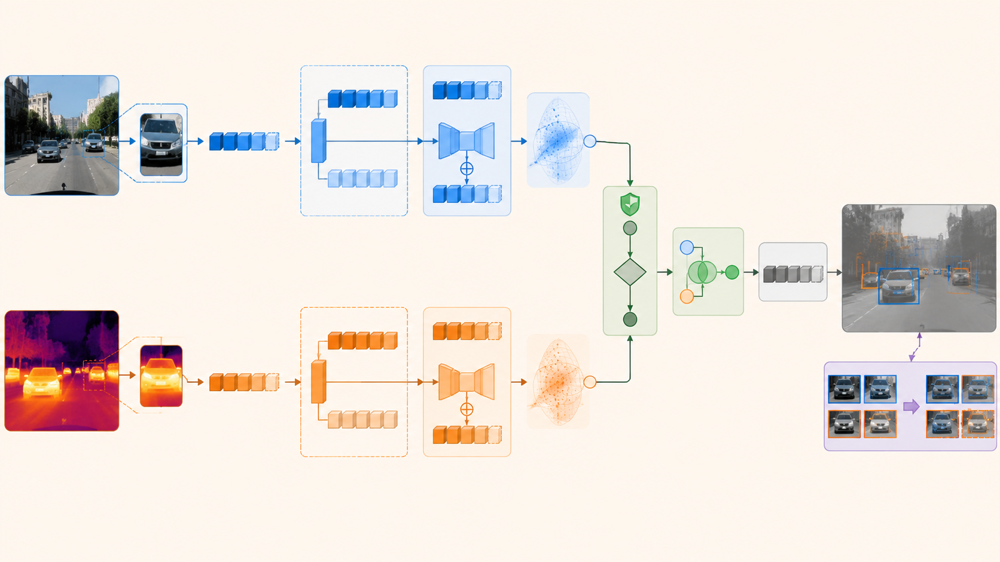
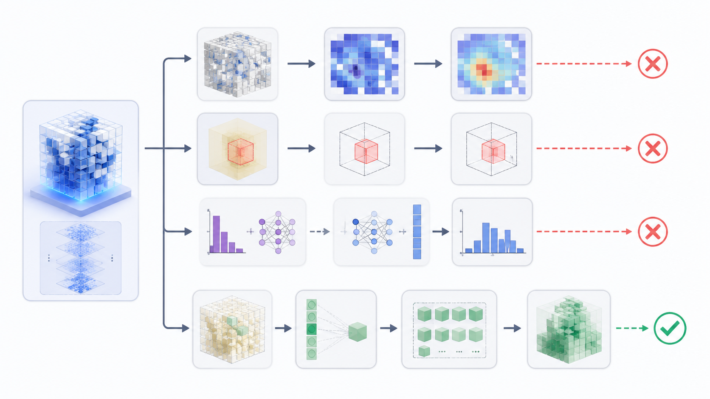

# 可信模态补全：为什么不该执着于补一张红外图，而应该补任务需要的证据

缺失模态补全最直观的做法，是把缺失的一路重新生成出来。RGB 缺失时生成 RGB，IR 缺失时生成 IR，然后把生成结果送回原有的双光融合检测器。这个思路看起来顺畅，但它隐含了一个很强的假设：缺失模态可以由可见模态确定恢复。

在无人机 RGB-IR 目标检测中，这个假设并不成立。RGB 到 IR、IR 到 RGB 都是多解映射。同一块可见光纹理可能对应不同热响应，同一块红外热斑也可能对应不同可见外观。更关键的是，检测任务需要的不是一张视觉上完整的图，而是能帮助目标定位、分类、置信度校准和候选框修正的任务证据。

因此，可信模态补全的核心不应是“补得像不像”，而应是：

> 补出来的证据是否对检测有用，以及模型是否知道这份证据什么时候不可靠。

## 1. 补全对象：从图像到候选证据

缺失模态补全可以分成四个层级：原始图像、dense feature map、ROI/query token、candidate-level correction。

图 1：补全对象越接近检测候选，越能避免背景幻觉和无效重建。

### 1.1 原始图像补全

图像补全最直观，但风险最大。生成一张红外图或 RGB 图，可能在视觉上合理，却没有保留检测所需的目标边界、热结构或类别证据。对安全感知任务而言，伪造出来的视觉细节还可能被检测器误当成真实证据。

### 1.2 Dense feature map 补全

特征图补全比图像补全更接近检测任务，但仍然面临背景主导问题。无人机小目标检测中，目标区域占比很小，全图特征回归容易把学习能力花在背景统计上，而不是候选目标附近的关键证据。

### 1.3 ROI / query token 补全

ROI 或 query token 是更合适的补全单位。每个 token 对应一个候选目标或潜在目标区域，补全器只需要回答：在这个候选附近，缺失模态能提供什么任务相关信息？

这种粒度有三个优势：

- 避免在大面积背景上制造伪特征；
- 补全目标和检测监督更一致；
- 可以为每个候选单独估计补全可信度。

### 1.4 Candidate-level correction

候选级修正进一步靠近检测输出。它不再尝试恢复完整特征，而是直接预测 box correction、class correction 和 credibility score。这种方式更符合检测任务的最终需求：修正候选框和类别，而不是恢复一个完整模态。

## 2. 补全不是替换，而是条件介入

真实模态存在且质量高时，补全特征不应该覆盖真实特征。真实模态缺失或软失效时，补全才有介入价值。可以先定义模态可用强度：

$$
a^m_i=m^m\cdot q^m_i,\quad a^m_i\in[0,1]
$$

其中 $m^m$ 表示硬缺失状态，$q^m_i$ 表示第 $i$ 个目标区域或候选 token 上的软质量。最终使用的模态特征为：

$$
\tilde{F}^{m}_i=
a^m_iF^m_i+(1-a^m_i)c^m_i\hat{F}^{m}_i
$$

其中 $c^m_i$ 是补全可信度。

这个公式表达了三个原则：

1. 真实模态可靠时，优先使用真实特征；
2. 真实模态缺失或低质时，补全特征才介入；
3. 补全可信度低时，补全特征应被抑制。

这比“生成一个缺失模态并直接替换”更安全。

## 3. 可信补全的三层结构

### 3.1 补共享语义，不补私有细节

RGB 和 IR 共享的信息通常包括目标位置、主体轮廓、类别语义和场景结构。它们的私有信息则包括 RGB 的纹理、颜色、高频边缘，以及 IR 的热响应和热对比。

因此，补全应先恢复共享语义：

$$
F^m=[F^m_{sh},F^m_{sp}]
$$

当 IR 缺失时，可由 RGB shared feature 预测缺失模态的共享锚点：

$$
\hat{F}^{t}_{sh}=A_{r\rightarrow t}(F^r_{sh})
$$

这个共享锚点负责“目标在哪里、是什么类别、轮廓大致如何”，而不是负责完整红外成像。

### 3.2 补模态特异残差，并估计不确定性

仅有共享语义不足以恢复模态互补。IR 对热目标主体有特殊贡献，RGB 对边界和纹理有特殊贡献。因此更合理的补全形式是残差：

$$
\hat{F}^{t}_i=\hat{F}^{t}_{sh,i}+\Delta \hat{F}^{t}_{sp,i}
$$

其中 $\Delta \hat{F}^{t}_{sp,i}$ 是对检测有用的模态特异残差。补全模块同时输出方差或不确定性：

$$
\mu_i,\log\sigma_i^2=C(F_i^{avail},m,q)
$$

这样检测头不仅获得补全证据，也获得这份证据的可靠性估计。

### 3.3 补目标区域，不补整图背景

无人机检测中的目标小，背景大。补全单位应尽量转为 ROI/query token：

$$
z^m_i=ROIAlign(F^m,b_i)
$$

或：

$$
z^m_i=Q_i(F^m)
$$

补全器输出：

$$
\hat{z}^{miss}_i,u^{miss}_i,c^{miss}_i=C(z^{avail}_i,P^{miss},q_i)
$$

其中 $P^{miss}$ 可以是缺失模态 prompt、类别原型、热目标 memory 或 learnable token。

## 4. TCCM：目标感知可信补全模块

Target-aware Credible Completion Module，简称 TCCM，可以作为候选级可信补全模块。

图 2：TCCM 在候选目标附近补任务相关证据，并用可信度控制补全特征是否注入检测路径。

TCCM 的输入为：

$$
(F^r,F^t,m^r,m^t,q^r,q^t)
$$

输出为：

$$
(\tilde{F}^r,\tilde{F}^t,c^r,c^t,u^r,u^t)
$$

### 4.1 Shared-Specific Splitter

先拆分共享特征和模态私有特征：

$$
F^m_{sh}=S_{sh}(F^m),\quad F^m_{sp}=S^m_{sp}(F^m)
$$

共享特征用于跨模态语义补全，私有特征用于保留 RGB/IR 的独特贡献。辅助约束可以包括共享特征一致性和 shared-specific 解耦，但权重不宜过大，否则会损害检测特征。

### 4.2 Residual Completer

以 IR 补 RGB 为例：

$$
h_i^{t\rightarrow r}=
\text{Concat}(z^t_{sh,i},z^t_{sp,i},P^r,q^r_i,q^t_i,m^r,m^t)
$$

输出：

$$
\mu^r_i,\log\sigma^{2,r}_i=R_{t\rightarrow r}(h_i^{t\rightarrow r})
$$

补全 token：

$$
\hat{z}^{r}_i=z^t_{sh,i}+\mu^r_i
$$

其中 $\mu^r_i$ 是 RGB 特异残差，而不是完整 RGB feature map。

### 4.3 Credibility Head

补全可信度可以由残差、方差、质量分数和缺失状态共同决定：

$$
c^r_i=
\sigma(MLP([\mu^r_i,\log\sigma^{2,r}_i,q^r_i,q^t_i,m^r,m^t]))
$$

这个分支决定补全结果是否进入检测路径。低可信补全应被抑制，而不是强行注入。

### 4.4 Safe Blend

最终使用 safe blend：

$$
\tilde{z}^{m}_i=
a^m_i z^m_i+(1-a^m_i)c^m_i\hat{z}^{m}_i
$$

真实模态可靠时，补全几乎不起作用；真实模态缺失或低质时，补全介入；补全不可信时，模型退回可见模态路径。

## 5. 实验现象：补全有上界，但 dense map 不是正确对象

已有实验给出一个清晰信号：补全方向有价值，但整图 dense feature 补全不是最优粒度。

图 3：oracle feature 证明补全存在上界，但 dense map、ROI 回归和蒸馏没有突破 baseline。ROI token probe 的阳性结果把方向推向候选级补全。

关键观察如下：

| 实验 | 观察 | 结论 |
| --- | --- | --- |
| missing RGB 快速评估 | mAP@0.5 从 full 的 0.879 掉到 0.760 | RGB 证据缺失明显伤检测 |
| oracle RGB feature | 能把 missing RGB 拉近 full | 补全存在上界 |
| dense residual completer | 没有超过 missing baseline | 整图特征回归不适合主线 |
| ROI feature regression | 仍未突破 | ROI 加权不等于候选决策 |
| prediction distillation | dense completer 仍无效 | 监督目标仍偏间接 |
| ROI token probe | `model.29` 余弦相似度 0.9970 | 候选级映射可学 |

这组结果说明，问题不在于“缺失模态没有可补信息”，而在于补全对象和监督目标需要更贴近检测决策。

## 6. 补全与配准的关系

无人机 RGB-IR 中，补全和配准不能割裂。若某一路缺失或严重低质，直接估计跨模态 offset 可能不可靠。更合理的顺序是：先在 ROI/query 层恢复目标语义，再判断几何对齐是否可信。

可以定义 offset 可信度：

$$
c_{\Delta,i}=G_\Delta(c^r_i,c^t_i,u^r_i,u^t_i,q^r_i,q^t_i,m^r,m^t)
$$

最终对齐输出：

$$
F^{align}_i=
c_{\Delta,i}\cdot Deform(F_i,\Delta_i)
+(1-c_{\Delta,i})\cdot F_i
$$

补全可信时，对齐才有意义；补全和模态质量都低时，强行估计 offset 只会制造伪对齐。

## 7. 创新点总结

可信模态补全的创新不在于生成更逼真的图像，而在于把补全对象从“视觉完整性”转向“任务证据”：

1. **候选级补全**：围绕 ROI/query token 补缺失模态证据，避免背景幻觉。
2. **Shared-Specific 结构**：先补共享语义，再补模态特异残差。
3. **显式可信度估计**：补全器输出不确定性和可信度，低可信时拒绝注入。
4. **Safe Blend**：真实模态可靠时优先使用真实特征，缺失或低质时才使用补全证据。
5. **补全-配准联动**：补全可信度影响 offset 是否可用，避免低质状态下伪对齐。

这个方向的核心判断是：检测任务并不需要补出一个完整模态，而需要在候选目标级别补出可用、可校准、可拒绝的证据。

