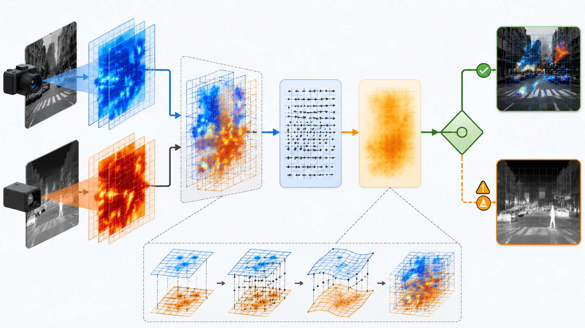
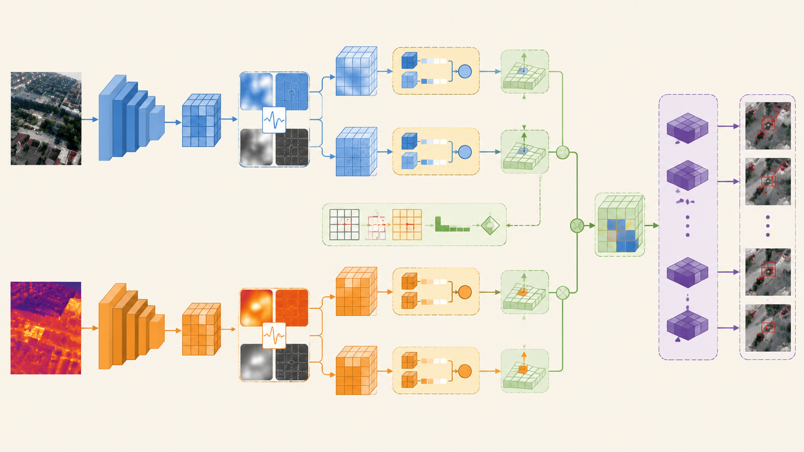

# 从固定融合到质量路由：区域-频段有效性感知的 RGB-IR 弱配准检测框架

RGB-IR 双光检测的传统融合范式通常默认两路模态同时存在、质量可靠，并且已经完成空间对齐。基于这个假设，常见方法会使用拼接、加权、注意力、跨模态 Transformer 或 deformable alignment 来融合 RGB 和 IR 特征。

这个范式在干净数据上有效，但在无人机场景中存在明显局限。RGB 可能在高频边界上可靠，却在低照条件下整体失效；IR 可能在低频热结构上稳定，却在热交叉场景中提供错误响应；即使两路模态都有效，弱配准也可能把背景特征引入目标 ROI。固定融合缺少一个关键能力：判断当前证据是否值得被融合。

更合适的思路是把 RGB-IR 融合建模成**证据可靠性驱动的动态路由问题**：

$$
F_i^{fus}=G(F_i^r,F_i^t,a_i^r,a_i^t,c_{\Delta,i})
$$

其中 $a_i^m$ 表示第 $i$ 个区域上的模态可用强度，$c_{\Delta,i}$ 表示对齐可信度。融合模块不再盲目使用所有特征，而是根据区域质量、频段质量和 offset 可靠性决定如何使用证据。

## 1. 区域-频段质量场

RGB 和 IR 的互补并不是全局恒定的。质量探针显示，IR 在低频结构上更强，RGB 在高频边缘和 ROI 细节上更强：

| 指标 | RGB 均值 | IR 均值 | RGB-IR |
| --- | ---: | ---: | ---: |
| 全图综合质量 | 0.6069 | 0.5010 | +0.1060 |
| sharpness | 0.4858 | 0.0837 | +0.4021 |
| contrast | 0.5536 | 0.7515 | -0.1979 |
| entropy | 0.8378 | 0.8801 | -0.0423 |
| 低频质量 | 0.6722 | 0.8133 | -0.1412 |
| 高频质量 | 0.1340 | 0.0772 | +0.0568 |
| ROI 质量 | 0.7340 | 0.5260 | +0.2080 |

图 1：IR 更偏低频热结构，RGB 更偏高频边缘和目标 ROI。区域-频段质量比全图质量更适合小目标检测。

因此，质量建模应从单一全图分数扩展为区域-频段质量：

$$
q^m_{i,L}=Q_L(ROI_i(F^m_L)),\quad
q^m_{i,H}=Q_H(ROI_i(F^m_H))
$$

其中 $L$ 表示低频结构，$H$ 表示高频细节，$i$ 表示 ROI、anchor 或 detection query。

## 2. 频段门控融合

区域-频段质量可以直接用于低频和高频的分开融合。

低频权重：

$$
\alpha^m_{i,L}=
\frac{\exp(q^m_{i,L})}
{\exp(q^r_{i,L})+\exp(q^t_{i,L})}
$$

高频权重：

$$
\alpha^m_{i,H}=
\frac{\exp(q^m_{i,H})}
{\exp(q^r_{i,H})+\exp(q^t_{i,H})}
$$

对应融合：

$$
F_{i,L}=\alpha^r_{i,L}F^r_{i,L}+\alpha^t_{i,L}F^t_{i,L}
$$

$$
F_{i,H}=\alpha^r_{i,H}F^r_{i,H}+\alpha^t_{i,H}F^t_{i,H}
$$

这类设计的优势在于可解释性。低频融合更倾向热主体、轮廓和低照结构；高频融合更关注边界、纹理和小目标细节。它不是普通 attention 的重复命名，而是将 RGB-IR 成像机制差异显式转化为融合策略。

## 3. Offset Reliability Gate

弱配准是 UAV RGB-IR 检测中的核心问题。OAFA、CoDAF 等方法已经证明 feature-level alignment 对双光检测有价值。但在模态缺失或软失效场景中，offset 本身也可能不可靠。

如果 RGB 低照、IR 热交叉，或者某一路模态缺失，offset estimator 可能输出错误位移。错误 offset 会把背景特征变形到目标区域，导致“对齐后比不对齐更差”。

图 2：offset 估计需要带可信度。高可信时使用对齐，低可信时退回 safe fusion。

因此，对齐模块应输出：

$$
\Delta_i,u_{\Delta,i}=A(F^r_i,F^t_i,m^r,m^t,q^r_i,q^t_i)
$$

其中 $\Delta_i$ 是 offset，$u_{\Delta,i}$ 是不确定性。对齐置信度定义为：

$$
c_{\Delta,i}=m^r m^t\cdot \sigma(h(q^r_i,q^t_i,u_{\Delta,i}))
$$

最终对齐输出：

$$
F^{align}_i=
c_{\Delta,i}\cdot Deform(F_i,\Delta_i)
+(1-c_{\Delta,i})\cdot F_i
$$

这个门控机制解决的是“什么时候不该对齐”。当任一模态缺失、质量低或 offset 不确定性高时，对齐分支应自动降权。

## 4. 动态参考模态选择

许多双光方法默认 thermal 作为 reference，因为 IR 在低照和夜间场景下更稳定。但这个假设并不总成立。热交叉、地面高温、红外低分辨率或传感器噪声都会让 IR 失去参考价值。

参考模态可以改成区域级动态选择：

$$
ref_i=\arg\max_{m\in\{r,t\}}q_i^m
$$

也可以使用 soft reference：

$$
F_i^{ref}=\rho_iF_i^r+(1-\rho_i)F_i^t
$$

$$
\rho_i=\sigma(h(q_i^r-q_i^t))
$$

这样 reference 不再由固定先验决定，而由当前区域的模态有效性决定。

## 5. 多专家路由与安全拒识

当不同模态在不同退化状态下可靠性不同，单一 fusion head 未必最优。更稳的结构是保留多个专家：

- RGB expert；
- IR expert；
- Fusion expert；
- Completion expert；
- Safe / rejection path。

路由权重由模态质量、缺失状态、offset 不确定性和补全可信度共同决定：

$$
\pi=\text{Softmax}(R(q^r,q^t,u_\Delta,m^r,m^t,c^{miss}))
$$

最终输出：

$$
\hat{y}=\sum_e\pi_eD_e(F)
$$

当专家分歧较大时，可以用分歧度降低置信度：

$$
U=\text{Var}(\{D_e(F)\})
$$

若 $U$ 超过阈值，模型应降低输出置信，甚至拒绝某些低可信候选。对无人机安全任务来说，低质输入下的高置信错误框比保守输出更危险。

## 6. RF-MVFNet 框架

区域-频段模态有效性感知框架可以概括为 RF-MVFNet：Region-Frequency Modality-Validity Fusion Network。

图 3：RF-MVFNet 将区域-频段质量、缺失感知弱配准、安全融合和动态专家路由放入同一检测框架。

整体流程如下：

1. RGB 和 IR 分支分别提取多尺度特征；
2. 轻量频段分解得到低频结构和高频细节；
3. quality probe 估计 $q^m_{i,L}$、$q^m_{i,H}$ 和 ROI 质量；
4. offset 模块估计 $\Delta_i$ 和 $u_{\Delta,i}$；
5. offset reliability gate 计算 $c_{\Delta,i}$；
6. 低频、高频分别做质量门控融合；
7. safe fusion 控制是否使用对齐结果；
8. 多专家检测头根据质量和不确定性路由；
9. TCCM 补全分支仅在低可用强度且高补全可信度时介入。

这个框架的中心不是模块堆叠，而是可靠性变量之间的关系：质量决定融合，质量和不确定性决定对齐，补全可信度决定是否注入伪证据。

## 7. 与已有方法的区别

| 工作方向 | 已解决的问题 | RF-MVFNet 的差异 |
| --- | --- | --- |
| OAFA | UAV RGB-IR weak alignment | 关注缺失/低质状态下 offset 是否可信 |
| CoDAF | offset-guided dynamic alignment and fusion | 用区域-频段有效性和缺失状态控制 alignment/fusion |
| WaveMamba | wavelet-driven frequency fusion | 关注频段有效性，而非单纯频域增强 |
| CoLA | quality-aware dropout | 从全图质量推进到 ROI/频段质量 |
| MoETrack / MV-RGBT | when to fuse | 路由同时考虑质量、缺失、offset 和补全可信度 |

这些差异都指向同一个目标：在不完整、不稳定、弱配准的双光输入中安全使用证据。

## 8. 训练协议：反事实缺失增强

结构设计需要配合训练协议。可以为同一张图构造多种反事实输入：

$$
(x^r,x^t),\quad (x^r,\varnothing),\quad (\varnothing,x^t),
\quad (\tilde{x}^r,x^t),\quad (x^r,\tilde{x}^t)
$$

其中 $\tilde{x}$ 表示软退化，例如低照、模糊、热交叉、压缩损坏或错位。

高层语义保持一致：

$$
\mathcal{L}_{cf}=
\sum_s KL(P(y|x^r,x^t),P(y|s))
$$

但不应强制低层特征点对点一致。缺失输入和完整输入的信息量不同，过强的特征对齐会让模型学习伪相关。更合理的是约束检测语义稳定，同时允许不确定性上升。

## 9. 技术贡献总结

区域-频段质量感知与弱配准融合的技术贡献可以总结为四点：

1. **区域-频段有效性建模**：从全局模态质量扩展到 ROI 级、低频/高频级质量。
2. **频段门控融合**：低频和高频分别选择更可靠模态，利用 RGB-IR 物理互补。
3. **Offset Reliability Gate**：offset 不再默认可信，缺失和低质状态下自动退回 safe fusion。
4. **多专家安全路由**：根据质量、不确定性和补全可信度选择 RGB、IR、Fusion 或 Completion 路径。

这套框架的核心原则是：融合不是越多越好，而是可信才融合。

