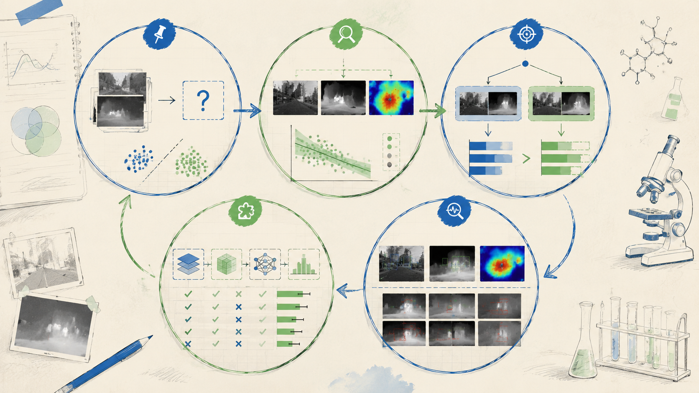
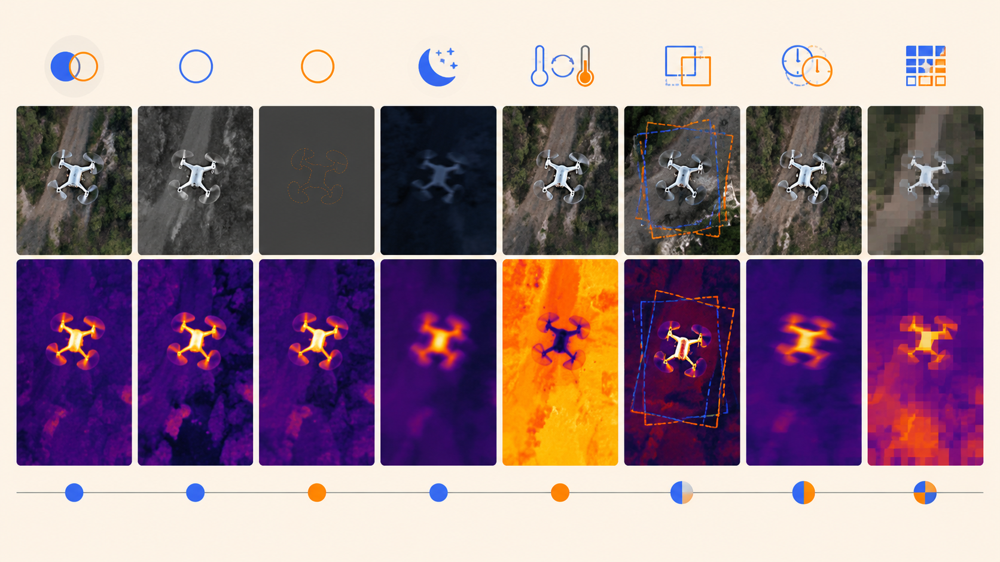
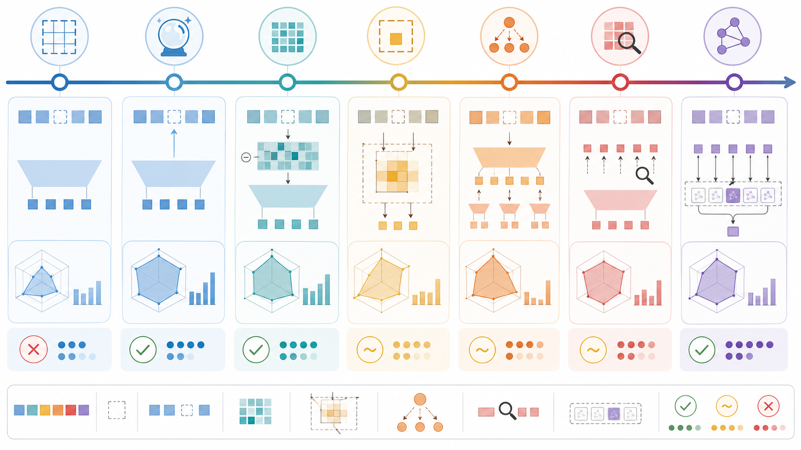

# 如何验证一个不完全双光融合方案：从质量探针、负结果到实验闭环

不完全 RGB-IR 双光融合方案不能只依靠模块设计来证明有效。一个完整的实验闭环需要依次回答：问题是否真实存在、缺失和退化会造成多大损失、质量分数是否和检测失败相关、动态路由是否有上界、补全是否真的有价值、对齐门控是否能避免伪对齐。

因此，实验设计应围绕证据链组织，而不是围绕模块堆叠组织。



图 1：从问题证明、质量相关性、oracle 上界、模块消融到失败分析，构成不完全双光融合方案的验证闭环。

## 1. 问题证明实验

第一步是证明缺失模态确实会造成性能下降，并明确缺 RGB 与缺 IR 的影响是否对称。

已有 M3FD 快速评估结果如下：

| case | P | R | mAP@0.5 | mAP@0.75 | mAP@0.5:0.95 |
| --- | ---: | ---: | ---: | ---: | ---: |
| full_clean | 0.900 | 0.838 | 0.879 | 0.616 | 0.586 |
| missing_ir_rgb_rescue | 0.860 | 0.759 | 0.815 | 0.516 | 0.503 |
| missing_rgb_ir_rescue | 0.816 | 0.714 | 0.760 | 0.483 | 0.472 |

相较完整双光：

$$
Drop_{IRmissing}^{mAP50}=0.879-0.815=0.064
$$

$$
Drop_{RGBmissing}^{mAP50}=0.879-0.760=0.119
$$

在 mAP@0.5:0.95 上：

$$
Drop_{IRmissing}=0.586-0.503=0.083
$$

$$
Drop_{RGBmissing}=0.586-0.472=0.114
$$

这个结果说明：完整双光明显优于缺失输入，且当前模型缺 RGB 时下降更明显。补全和融合实验应重点关注 RGB 缺失、RGB 低质以及 IR 到 RGB 证据补全。

## 2. 退化协议设计

随机 modality dropout 只能覆盖最理想的缺失设定。无人机 RGB-IR 检测还需要覆盖软失效、弱配准、链路退化和频段退化。



图 2：退化协议应覆盖 hard missing、soft invalid、misalignment、temporal delay 和 compression artifacts。

推荐实验设置如下：

| 退化类型 | 设置 | 目的 |
| --- | --- | --- |
| Full | RGB + IR 完整清晰 | 完整双光上界 |
| Missing RGB | RGB 置空或 mask | 测 IR 单路和 RGB 补全价值 |
| Missing IR | IR 置空或 mask | 测 RGB 单路和 IR 补全价值 |
| RGB soft invalid | 低照、模糊、过曝、烟雾 | 测质量感知是否能降权 RGB |
| IR soft invalid | 热交叉、饱和、低分辨率 | 测质量感知是否能降权 IR |
| Misalignment | 平移、缩放、局部错位 | 测 offset gate 是否有效 |
| Link degradation | 连续缺失、延迟、压缩块 | 模拟真实链路故障 |
| Frequency damage | 破坏低频或高频 | 验证区域-频段门控 |

每个 case 都对应明确问题：hard missing 测补全和单模态 expert，soft invalid 测质量感知，misalignment 测 offset reliability，frequency damage 测区域-频段建模。

## 3. 质量探针与失败相关性

质量探针需要证明两个事实：

1. RGB 和 IR 的优势不是全局固定的；
2. 质量分数与检测失败存在相关性。

已有 M3FD val 统计如下：

| 指标 | RGB 均值 | IR 均值 | RGB-IR |
| --- | ---: | ---: | ---: |
| 全图综合质量 | 0.6069 | 0.5010 | +0.1060 |
| sharpness | 0.4858 | 0.0837 | +0.4021 |
| contrast | 0.5536 | 0.7515 | -0.1979 |
| entropy | 0.8378 | 0.8801 | -0.0423 |
| 低频质量 | 0.6722 | 0.8133 | -0.1412 |
| 高频质量 | 0.1340 | 0.0772 | +0.0568 |
| ROI 质量 | 0.7340 | 0.5260 | +0.2080 |

进一步实验应按质量分桶统计检测结果：

- RGB 高频高 / 低；
- IR 低频高 / 低；
- RGB ROI 质量高 / 低；
- IR ROI 质量高 / 低；
- offset 置信度高 / 低。

如果低质量组中固定 fusion 显著退化，而质量感知路由能改善结果，就能证明模态有效性建模不是普通正则化，而是确实命中了失败模式。

## 4. Oracle 路由上界

动态路由是否值得做，需要先看 oracle 上界。基本流程是：

1. 分别运行 RGB-only、IR-only、Fusion、Completion 等专家；
2. 对每个 GT 目标匹配不同专家的预测框；
3. 事后选择 IoU 最优的专家作为 oracle；
4. 比较 fixed fusion、quality-rule routing 和 oracle routing。

路由样本可以组织为：

```json
{
  "image_id": "xxx",
  "gt": [x1, y1, x2, y2],
  "predictions": {
    "rgb": [[x1, y1, x2, y2, conf, cls]],
    "ir": [[x1, y1, x2, y2, conf, cls]],
    "fusion": [[x1, y1, x2, y2, conf, cls]]
  },
  "quality": {
    "rgb_high_quality": 0.13,
    "ir_high_quality": 0.08,
    "rgb_low_quality": 0.67,
    "ir_low_quality": 0.81,
    "rgb_roi_quality": 0.73,
    "ir_roi_quality": 0.53
  }
}
```

输出指标包括：

- oracle_iou_mean；
- quality_rule_iou_mean；
- fusion_iou_mean；
- quality_rule_regret_mean；
- oracle 选择 RGB / IR / Fusion 的比例。

如果 oracle 明显优于 fixed fusion，说明不同样本或目标上的最优专家并不固定；如果简单质量规则已经优于 fixed fusion，说明区域-频段质量具有路由价值。

## 5. 可信补全实验链

可信补全实验应从 oracle 上界开始，而不是直接训练复杂补全网络。



图 3：补全实验从 oracle 上界出发，逐步验证 dense completer、ROI 回归、蒸馏、ROI token 和候选级修正。

关键实验结论如下：

| 实验 | 结果/观察 | 对方法的影响 |
| --- | --- | --- |
| 快速缺失三案 | missing RGB 掉点更明显 | IR -> RGB 补全更急迫 |
| oracle feature | oracle RGB feature 能接近 full | 补全有上界 |
| dense residual completer | 没有超过 missing baseline | 不应补整图 feature map |
| ROI feature regression | 仍然没有突破 | ROI 加权不等于候选决策 |
| prediction distillation | dense completer 仍无效 | 监督目标仍偏间接 |
| ROI token probe | `model.29` 余弦相似度 0.9970 | 候选级映射可学 |
| TCCM-v1 rerank | 离线候选重评分跑通 | 应继续做 correction head |

这条实验链说明：补全方向有价值，但补全对象应从 dense map 转向 ROI/query token 或 candidate correction。

## 6. 区域-频段门控消融

区域-频段门控的消融应回答“质量建模到底在哪个层级有效”：

| 设置 | 回答的问题 |
| --- | --- |
| no quality | 固定融合基线 |
| global quality | 全图质量是否有用 |
| ROI quality | 目标区域质量是否优于全图 |
| frequency quality | 频段质量是否有额外价值 |
| region-frequency quality | 区域和频段结合是否最有效 |
| region-frequency + missing mask | 硬缺失和软质量联合是否必要 |

评估重点包括：

- full clean 下不能明显掉点；
- missing RGB / missing IR 下应提升；
- soft invalid 组应更稳定；
- 小目标 AP 应对 ROI/高频质量更敏感；
- 低质量分组应体现更明显收益。

## 7. 缺失感知弱配准消融

弱配准实验不应只证明“对齐有用”，而应证明“offset 可信度有用”。推荐消融：

| 设置 | 目的 |
| --- | --- |
| no alignment | 不做对齐 |
| always alignment | 只要估到 offset 就用 |
| quality-gated alignment | 低质量时少用 offset |
| uncertainty-gated alignment | offset 不确定时少用 |
| missing-aware alignment | 缺失、质量、uncertainty 联合控制 |

关键观察：

- clean 或轻微错位下，对齐应有帮助；
- 低质或缺失下，always alignment 可能伤害；
- offset gate 应减少错误对齐导致的退化；
- 低可信 offset 应集中在模糊、热交叉、遮挡或小目标错位区域。

## 8. 主结果表设计

主结果表不应只报告完整输入。至少需要覆盖：

| Method | Full | Missing RGB | Missing IR | RGB invalid | IR invalid | Misaligned | Avg Robust | Cost |
| --- | ---: | ---: | ---: | ---: | ---: | ---: | ---: | ---: |
| RGB-only |  |  |  |  |  |  |  |  |
| IR-only |  |  |  |  |  |  |  |  |
| Fusion baseline |  |  |  |  |  |  |  |  |
| + quality gate |  |  |  |  |  |  |  |  |
| + offset gate |  |  |  |  |  |  |  |  |
| + TCCM |  |  |  |  |  |  |  |  |

Avg Robust 可以是多个退化 case 的平均，也可以计算 robustness AUC。Cost 至少报告推理时间、参数量或 FLOPs。

## 9. 可视化设计

可视化应服务论点，而不是只展示检测框。推荐包含：

- 质量热力图：显示 RGB/IR 在不同区域的可靠性；
- 频段权重图：显示低频和高频分别选择哪个模态；
- offset 可视化：展示高可信和低可信 offset 的差异；
- expert routing 图：展示不同目标选择不同专家；
- 补全可信度图：展示 TCCM 何时注入、何时拒绝；
- 失败案例：展示极端热交叉、双模态低质或严重错位。

每张图都应回答一个问题：这个模块为什么有用，或者它在什么边界条件下失效。

## 10. 最小可落地版本

一个可控的第一版不应同时堆满所有模块。推荐最小闭环：

1. 问题证明：hard missing、soft invalid、misalignment 都会伤检测；
2. 区域-频段质量探针：证明 RGB/IR 在低频、高频、ROI 上互补；
3. Region-Frequency Gate：用质量驱动低频/高频融合；
4. Offset Reliability Gate：低可信 offset 不强行对齐；
5. Safe Fusion / Router：避免低质模态污染；
6. TCCM 作为补全上界和候选级扩展分析。

如果 TCCM candidate correction 稳定提升，可以把主线切到可信补全；如果还不稳定，则将其作为补全上界和负结果分析，避免方法故事过散。

## 11. 实验闭环的核心标准

一个不完全双光融合方案是否成立，取决于证据链是否闭合：

- 真实退化会让固定融合失效；
- RGB 和 IR 的优势是区域/频段相关的；
- offset 在低质或缺失状态下并不总可信；
- 补全有上界，但整图补全不是正确对象；
- 质量、补全可信度和 offset 置信度能共同指导更安全的检测决策。

如果这些证据成立，方法设计就不是模块堆叠，而是由问题和实验共同推出的鲁棒双光检测框架。
