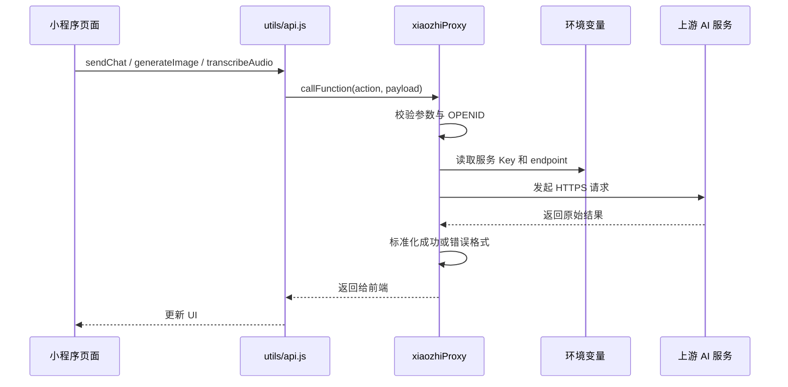

小程序前端不能保存上游服务 Key。更合理的做法是把所有敏感配置放到云函数环境变量里，前端只传业务参数，由云函数统一完成鉴权、密钥注入、上游请求和错误归一化。

这篇拆的是 `xiaozhiProxy` 这一层：它不是一个简单的转发器，而是小程序 AI 能力的安全边界。

## 代理层要解决什么

前端发起请求时，只应该传业务字段：

| 能力 | 前端传入 | 云函数补齐 |
| --- | --- | --- |
| 聊天 | `messages`、`model`、`web` | `SUNEORA_API_KEY`、标准 endpoint |
| 生图 | `prompt`、`size` 或 `taskId` | `SUNEORA_IMAGE_API_KEY`、任务轮询 |
| 语音转写 | `fileId`、`name`、`mimeType` | `SUNEORA_AUDIO_API_KEY`、multipart form |
| 历史保存 | `conversation` | 云函数侧 `openid` |

这样前端既拿不到 Key，也不能伪造用户归属。

## action 分发

`utils/api.js` 调用云函数时统一传：

```js
{
  action: 'chat',
  payload: {}
}
```

`cloudfunctions/xiaozhiProxy/index.js` 再根据 `action` 做分发：

| action | 处理函数 | 说明 |
| --- | --- | --- |
| `health` | `handleHealth` | 返回配置状态 |
| `models` | `handleModels` | 拉取模型列表，失败时使用 fallback |
| `chat` | `handleChat` | 调聊天模型 |
| `image` | `handleImage` | 创建或轮询图片任务 |
| `transcribeAudio` | `handleTranscribeAudio` | 下载云存储音频并转写 |
| `extractAttachmentText` | `handleExtractAttachmentText` | 下载文本附件并截断返回 |

统一 action 的好处是前端 API 很薄，云函数可以集中处理权限、日志和错误。

## 请求链路



## 图片生成的关键点

图片接口不要让单次云函数调用一直等待任务完成。更稳的方式是：

1. 第一次请求带 `prompt`，云函数创建图片任务；
2. 云函数短轮询一次或两次；
3. 如果还没完成，返回可恢复的 pending 状态；
4. 前端继续带 `taskId` 调用 `image`；
5. 成功后展示 `imageUrl`。

pending 返回可以保持清晰：

```json
{
  "error": {
    "code": "IMAGE_PENDING",
    "message": "Image generation is still running."
  },
  "taskId": "<TASK_ID>",
  "status": "pending"
}
```

这里还有一个小细节：图片 URL 要统一规范化，尤其把 `http://img2.suneora.com/...` 转成 `https://img2.suneora.com/...`，避免真机或 WebView 环境下出现混合内容问题。

## 语音转写的关键点

语音链路建议先上传到云存储，再由云函数下载后转写：

- 前端不直接把音频发到上游服务；
- 云函数校验 `fileId` 是否属于当前 `openid`；
- 云函数用 multipart/form-data 上传音频；
- 转写成功后返回 `text`；
- 前端把 `text` 当普通用户消息发送给聊天模型。

这种设计会多一次云存储中转，但换来的是权限可控、历史可恢复、失败可重试。

## 代理层验收

运行：

```powershell
node --check cloudfunctions/xiaozhiProxy/index.js
node cloudfunctions/xiaozhiProxy/test.js
```

重点验证：

- 未登录访问历史、附件、语音接口返回鉴权错误；
- 缺少聊天 Key 时聊天返回配置缺失；
- 图片任务 pending 时返回 `IMAGE_PENDING`；
- 图片成功时返回 HTTPS URL；
- 语音缺少 Key 时返回明确错误；
- 文本附件超过限制时返回不可读状态。

## 小结

云函数代理层的价值不只是“隐藏 Key”。它还负责把 AI 服务包装成小程序可用的稳定接口：统一 action、统一错误、统一用户归属、统一附件和历史策略。前端越少知道上游细节，后续切模型、切供应商、加审计都会更容易。
