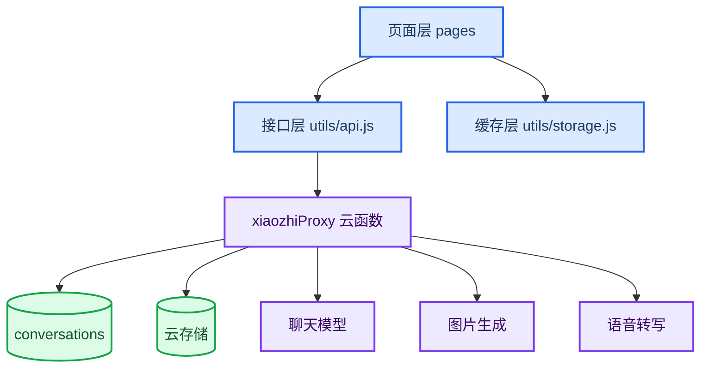

---
title: '小智小程序云开发架构复现'
date: 2026-05-18T09:10:00+08:00
draft: false
tags: ['微信小程序', '云开发', '云函数', 'AI 应用', '系统架构']
categories: ['AI 应用工程']
summary: '从原生微信小程序、云函数、云数据库三个层面复现可真机运行的 AI 聊天应用。'
ShowToc: true
TocOpen: true
mermaid: true
cover: 'images/cover-miniapp-cloud-architecture.svg'
---

_从原生微信小程序、云函数、云数据库三个层面复现可真机运行的 AI 聊天应用。_

---

## 🧭 架构目标

这个小程序不把 AI Key 放在前端，也不要求真机访问本机服务。推荐架构是：

- 小程序页面只负责交互、展示和调用云函数
- `utils/api.js` 统一封装 `wx.cloud.callFunction`
- `xiaozhiProxy` 云函数统一代理聊天、生图、语音转写和历史 CRUD
- `conversations` 云数据库按 `openid` 保存历史
- 云存储保存图片、文件、语音附件

## 🧱 分层结构



各层职责：

| 层 | 文件 | 责任 |
| --- | --- | --- |
| 页面层 | `pages/chat`、`pages/model`、`pages/history`、`pages/settings`、`pages/profile` | UI、用户操作、导航 |
| 接口层 | `utils/api.js` | 选择 cloud/proxy 模式，封装 action 调用 |
| 缓存层 | `utils/storage.js` | 设置、登录态、本地历史缓存、迁移标记 |
| 云函数层 | `cloudfunctions/xiaozhiProxy/index.js` | 密钥读取、AI 代理、数据隔离、附件处理 |
| 数据层 | `conversations`、云存储 | 历史记录和附件持久化 |

## 🚀 复现步骤

1. 在微信开发者工具导入 `xiaozhi-chat-miniprogram`。
2. 修改 `project.config.json`、`app.js`、`cloudbaserc.json` 里的 AppID 和云环境 ID。
3. 在云函数 `xiaozhiProxy` 配置聊天、图片、语音环境变量。
4. 部署云函数：

   ```powershell
   npx --yes --package @cloudbase/cli tcb fn deploy xiaozhiProxy --force --deployMode zip
   ```

5. 进入小程序设置页，确认服务模式为云开发。
6. 进入个人中心登录，再回聊天页验证功能。

## 🔄 为什么不依赖本机服务

真机上的 `127.0.0.1` 指向手机自身，不是开发电脑。云开发模式把网络出口移动到云函数：

- 真机只访问微信云开发能力
- 云函数访问上游 AI 服务
- 微信登录态由云函数上下文提供 `openid`
- 云数据库和云存储天然与云环境绑定

本机代理模式可以保留，但只适合调试兼容问题。

## ✅ 验收方式

基础命令：

```powershell
node --check app.js
node --check utils/api.js
node --check pages/chat/chat.js
node --check cloudfunctions/xiaozhiProxy/index.js
node cloudfunctions/xiaozhiProxy/test.js
```

手动验收：

- 登录后能聊天
- 切换 `gpt-image-2` 后能生图
- 上传附件后历史恢复仍可见
- 语音转写成功后按文本发送
- 换微信用户后历史为空


