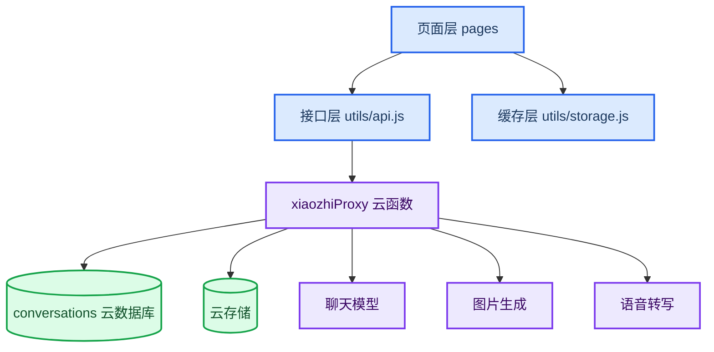

这篇记录的是一个“可真机运行”的 AI 聊天小程序复现方案。核心目标不是把页面画出来，而是把前端、云函数、云数据库和云存储的边界拆清楚：小程序端负责交互，云函数负责安全代理，云数据库和云存储负责用户级持久化。

如果把 AI Key 放在前端，或者让真机直接访问本机代理服务，这个项目很快就会遇到两个问题：安全风险和真机不可访问。因此推荐的架构是微信云开发优先。

## 架构目标

这套架构有五个约束：

- 小程序页面只负责交互、展示和调用云函数；
- `utils/api.js` 统一封装 `wx.cloud.callFunction`；
- `xiaozhiProxy` 云函数统一代理聊天、生图、语音转写和历史 CRUD；
- `conversations` 云数据库按 `openid` 保存聊天历史；
- 云存储保存图片、文件和语音附件。

这样做以后，真机只需要访问微信云开发能力；上游 AI 服务、环境变量和数据隔离都收敛到云函数侧。

## 分层结构



各层职责可以这样拆：

| 层 | 文件 | 责任 |
| --- | --- | --- |
| 页面层 | `pages/chat`、`pages/model`、`pages/history`、`pages/settings`、`pages/profile` | UI、用户操作、导航 |
| 接口层 | `utils/api.js` | 选择 cloud/proxy 模式，封装 action 调用 |
| 缓存层 | `utils/storage.js` | 设置、登录态、本地历史缓存、迁移标记 |
| 云函数层 | `cloudfunctions/xiaozhiProxy/index.js` | 密钥读取、AI 代理、数据隔离、附件处理 |
| 数据层 | `conversations`、云存储 | 历史记录和附件持久化 |

## 复现步骤

从零复现时，我会按下面顺序做，而不是先堆页面：

1. 在微信开发者工具导入 `xiaozhi-chat-miniprogram`。
2. 修改 `project.config.json`、`app.js`、`cloudbaserc.json` 里的 AppID 和云环境 ID。
3. 在云函数 `xiaozhiProxy` 配置聊天、图片、语音相关环境变量。
4. 部署云函数：

   ```powershell
   npx --yes --package @cloudbase/cli tcb fn deploy xiaozhiProxy --force --deployMode zip
   ```

5. 进入小程序设置页，确认服务模式为云开发。
6. 进入个人中心登录，再回聊天页验证聊天、历史、附件和生图链路。

## 为什么不依赖本机服务

真机上的 `127.0.0.1` 指向手机自身，不是开发电脑。所以小程序如果依赖本机代理，模拟器里可能能跑，真机上大概率直接断链。

云开发模式把网络出口移动到云函数：

- 真机只访问微信云开发；
- 云函数访问上游 AI 服务；
- 微信登录态由云函数上下文提供 `openid`；
- 云数据库和云存储天然绑定到云环境。

本机代理模式可以保留，但更适合调试兼容问题，不应该作为正式链路。

## 验收方式

基础检查命令：

```powershell
node --check app.js
node --check utils/api.js
node --check pages/chat/chat.js
node --check cloudfunctions/xiaozhiProxy/index.js
node cloudfunctions/xiaozhiProxy/test.js
```

手动验收重点：

- 登录后能聊天；
- 切换 `gpt-image-2` 后能生成图片；
- 上传附件后，刷新或重进历史仍可见；
- 语音转写成功后按普通文本发送；
- 换微信用户后历史为空。

## 小结

这个架构的关键不是“用了云开发”，而是把敏感能力、用户归属和持久化边界放在云函数侧。前端越轻，真机调试和后续扩展越稳；云函数越集中，鉴权、错误处理和上游服务替换也越容易维护。
