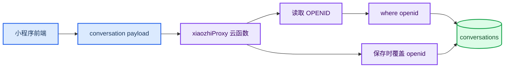

_复现小智小程序如何避免所有用户看到同一份聊天历史。_

---

## 🧨 问题背景

如果聊天历史只保存在一个全局本地 storage key 里，就会出现两个问题：

- 同一台设备上的不同用户可能看到同一批历史
- 换设备后历史无法同步

小程序云开发的正确做法是：云函数读取当前微信用户的 `openid`，所有历史记录都以这个 `openid` 为归属字段。

## 🔐 隔离原则

历史隔离不能信任前端传入的用户 ID。前端可以展示用户 ID，也可以缓存历史，但最终读写必须由云函数侧决定：



## 🗃️ 会话结构

`conversations` 集合中的每条记录包含：

| 字段 | 说明 |
| --- | --- |
| `id` | 前端生成的会话 ID |
| `openid` | 云函数写入的用户归属 |
| `title` | 会话标题 |
| `messages` | 消息数组 |
| `createdAt` | 创建时间 |
| `updatedAt` | 更新时间 |

消息里的 `attachments` 也跟随会话保存。删除或清空会话时，云函数会收集附件 `fileId` 并删除对应云存储文件。

## 🔄 本地缓存与云端同步

前端仍保留本地缓存，但 key 必须带用户命名空间：

| 本地 key | 说明 |
| --- | --- |
| `xiaozhi.conversations.<userId>` | 当前用户历史缓存 |
| `xiaozhi.activeConversationId.<userId>` | 当前用户 active 会话 |
| `xiaozhi.cloudMigrated.<userId>` | 当前用户是否完成迁移 |

同步策略：

1. 登录后调用 `listConversations`
2. 云端有历史时覆盖本地缓存
3. 云端为空且本地有当前用户历史时，迁移当前用户历史到云端
4. 不迁移其他用户命名空间的数据

## 🧪 双用户验证

可以通过本地单元测试或开发者工具云函数测试模拟两个用户：

1. A 用户调用 `saveConversation`
2. A 用户调用 `listConversations`，应看到 1 条
3. B 用户调用 `listConversations`，应看到 0 条
4. A 用户再次调用 `listConversations`，仍能看到自己的历史
5. A 用户删除或清空历史，B 用户历史不受影响

项目内置测试入口：

```powershell
node cloudfunctions/xiaozhiProxy/test.js
```

## ✅ 验收标准

- 未登录时历史页不展示任何历史
- 登录 A 后看到 A 的历史
- 退出后历史页不展示历史
- 登录 B 后看不到 A 的历史
- 登录回 A 后 A 的历史恢复
- 云数据库中每条会话都有 `openid`
- 前端传入的任何用户 ID 都不能改变云端归属
