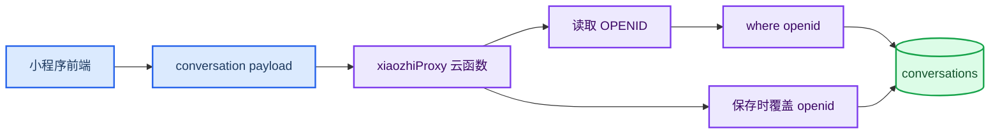

聊天应用一旦上云，最容易被低估的问题就是历史隔离。如果聊天历史只保存在一个全局本地 storage key 里，同一台设备上的不同用户可能看到同一批历史；换设备以后，历史又完全无法同步。

小程序云开发里更稳的做法是：由云函数读取当前微信用户的 `openid`，所有历史记录都以这个 `openid` 作为归属字段。

## 问题背景

本地缓存可以提升体验，但它不能成为最终事实来源。原因很简单：

- 前端缓存可能串用户；
- 前端传入的用户 ID 不可信；
- 换设备后本地缓存不存在；
- 附件如果只跟本地历史绑定，清理和恢复都会变复杂。

因此历史读写必须回到云函数侧，由云函数决定“当前请求属于谁”。

## 隔离原则

历史隔离不能信任前端传入的用户 ID。前端可以展示用户信息，也可以缓存当前用户历史，但最终读写必须由云函数侧的 `openid` 决定。



保存时，云函数应覆盖前端传入的任何 `openid` 或 `userId`。查询时，云函数也只允许 `where({ openid })`。

## 会话结构

`conversations` 集合中的每条记录可以包含：

| 字段 | 说明 |
| --- | --- |
| `id` | 前端生成的会话 ID |
| `openid` | 云函数写入的用户归属 |
| `title` | 会话标题 |
| `messages` | 消息数组 |
| `createdAt` | 创建时间 |
| `updatedAt` | 更新时间 |

消息里的 `attachments` 也跟随会话保存。删除或清空会话时，云函数需要收集附件 `fileId`，并删除对应云存储文件，避免留下无法追踪的孤儿文件。

## 本地缓存与云端同步

前端仍然可以保留本地缓存，但 key 必须带用户命名空间：

| 本地 key | 说明 |
| --- | --- |
| `xiaozhi.conversations.<userId>` | 当前用户历史缓存 |
| `xiaozhi.activeConversationId.<userId>` | 当前用户 active 会话 |
| `xiaozhi.cloudMigrated.<userId>` | 当前用户是否完成迁移 |

同步策略可以设计成四步：

1. 登录后调用 `listConversations`；
2. 云端有历史时覆盖本地缓存；
3. 云端为空且本地有当前用户历史时，迁移当前用户历史到云端；
4. 不迁移其他用户命名空间的数据。

这能兼顾首次迁移和跨设备同步，同时避免把 A 用户的历史迁到 B 用户名下。

## 双用户验证

可以通过本地单元测试或开发者工具云函数测试模拟两个用户：

1. A 用户调用 `saveConversation`；
2. A 用户调用 `listConversations`，应看到 1 条；
3. B 用户调用 `listConversations`，应看到 0 条；
4. A 用户再次调用 `listConversations`，仍能看到自己的历史；
5. A 用户删除或清空历史，B 用户历史不受影响。

项目测试入口：

```powershell
node cloudfunctions/xiaozhiProxy/test.js
```

## 验收标准

- 未登录时历史页不展示任何历史；
- 登录 A 后看到 A 的历史；
- 退出后历史页不展示历史；
- 登录 B 后看不到 A 的历史；
- 登录回 A 后 A 的历史恢复；
- 云数据库中每条会话都有 `openid`；
- 前端传入的任何用户 ID 都不能改变云端归属。

## 小结

历史隔离的关键是“归属只能在可信边界内决定”。在小程序云开发里，这个可信边界就是云函数上下文里的 `OPENID`。前端可以缓存、展示、触发同步，但不能决定云端记录属于谁。
