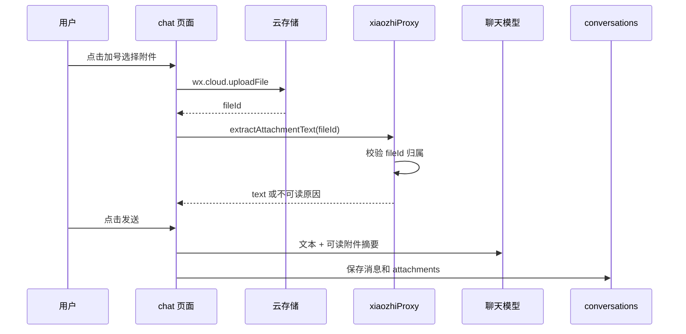

聊天应用的输入栏看起来只是一个 UI 组件，但一旦加入附件、拍照、文件解析和语音转写，它就变成了前端状态、云存储、云函数和聊天模型之间的协作入口。

这篇复盘的是一个接近微信体验的输入设计：底部 `+` 附件面板、长按录音、文本附件解析，以及语音转文字后继续调用聊天模型。

## 输入栏设计

聊天页底部可以拆成五个区域：

| 区域 | 功能 |
| --- | --- |
| 语音按钮 | 切换文本输入和“按住说话” |
| 输入框 | 普通文本输入 |
| `+` 按钮 | 展开附件面板 |
| 发送按钮 | 发送文本、附件或图片 prompt |
| 附件面板 | 图片、拍照、聊天文件 |

图片模式下，发送按钮用于生成图片；文本模式下，附件文本会被追加到 prompt 上下文。

## 附件数据结构

每个附件统一保存为：

```json
{
  "id": "attachment id",
  "type": "image | file | audio",
  "name": "file name",
  "size": 1234,
  "fileId": "cloud file id",
  "cloudPath": "attachments/<openid>/file",
  "mimeType": "text/plain",
  "duration": 0,
  "text": "extracted text",
  "status": "ready",
  "error": ""
}
```

同一份结构同时用于：

- 当前输入栏的待发送附件；
- 用户消息气泡展示；
- 云端历史持久化；
- 删除历史时回收云存储文件。

统一结构的好处是，上传、展示、保存、恢复和清理都可以复用同一套字段。

## 上传与解析流程



文本附件支持优先级可以先做轻量版：

| 类型 | 行为 |
| --- | --- |
| `.txt`、`.md`、`.json`、`.csv`、`.log` | 云函数读取、截断、加入上下文 |
| 图片 | 展示和预览，不做视觉理解 |
| PDF、Word、Excel | 第一版只保存附件卡片，不解析 |
| 二进制或超大文件 | 返回不可读状态，不阻塞聊天 |

这里的原则是：附件解析失败不能阻塞聊天。用户仍应能发送附件卡片和文本消息，只是模型不能读取不可解析内容。

## 语音输入流程

语音输入由 `wx.getRecorderManager` 驱动：

1. 点击语音按钮切换到语音模式；
2. 长按“按住说话”开始录音；
3. 上滑可取消；
4. 松手后得到临时音频文件；
5. 上传到云存储；
6. 调用 `transcribeAudio`；
7. 转写成功后生成用户消息：语音附件 + 转写文本；
8. 按普通文本消息调用聊天模型。

语音转写失败时，不应该丢弃语音附件。更好的做法是保留附件卡片，并展示清晰错误，让用户决定重试、删除或手动输入。

## 云函数接口

附件和语音相关 action：

| action | 输入 | 输出 |
| --- | --- | --- |
| `extractAttachmentText` | `fileId`、`name`、`mimeType` | `readable`、`text`、`reason` |
| `transcribeAudio` | `fileId`、`name`、`mimeType` | `text` |
| `saveConversation` | `conversation` | 保存后的会话 |
| `deleteConversation` | `id` | 删除状态，并清理附件 |
| `clearConversations` | 无 | 清空当前用户历史，并清理附件 |

所有接口都必须由云函数读取 `OPENID`，并检查附件是否属于当前用户。否则用户只要拿到别人的 `fileId`，就可能读到不该读的附件。

## 验收清单

运行检查：

```powershell
node --check pages/chat/chat.js
node --check cloudfunctions/xiaozhiProxy/index.js
node cloudfunctions/xiaozhiProxy/test.js
```

手动验收：

- 点击 `+` 后附件面板展开，再次点击收起；
- 选择图片后显示图片附件卡片，可预览；
- 拍照后图片上传并进入待发送列表；
- 选择 `.md` 文件后显示解析成功状态；
- 发送含文本附件的消息，模型能参考附件内容回答；
- 长按录音松开后，语音转写文本进入聊天；
- 转写失败时显示可读错误，不丢失语音附件；
- 换用户后看不到前一个用户的附件历史。

## 小结

附件和语音输入不是单纯的 UI 功能，而是小程序 AI 聊天应用的上下文入口。只要附件结构、云存储路径、云函数鉴权和历史持久化设计稳，后面接入图片理解、PDF 解析或更复杂的多模态能力都会自然很多。
